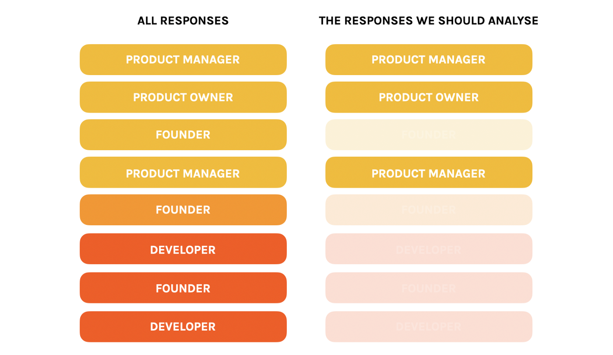
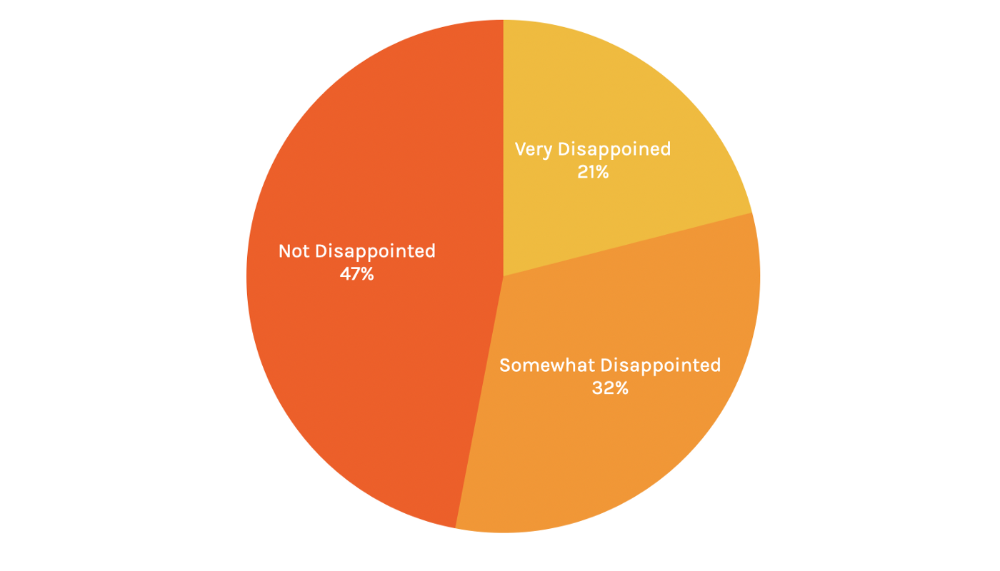
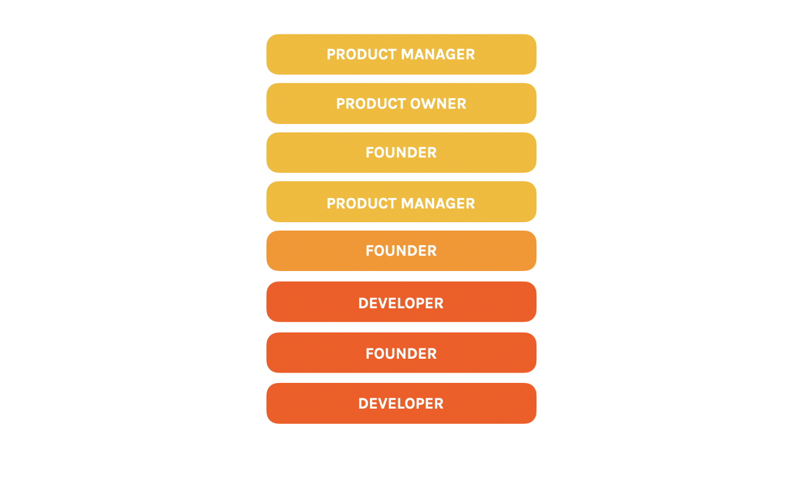

The term “Product/Market Fit” is too often used as just a buzzword. It conjures up some vague idea of building a “good” product, whatever that may mean.

Yet Product/Market Fit — actually, the lack of Product/Market Fit — is arguably the most important concept to both understand & to act upon in order to make your product a success.

Whether you are a founder, UX Designer or Product Manager, a lack of Product/Market Fit probably lies at the heart of all your current frustrations:

Lack of autonomy, lack of purpose, building features that you don’t feel make sense & with no idea of what the value of what you are building is for your customers & for your business.

Product/Market Fit is, as renowned VC Marc Andreeson points out, better defined as what it is not:

*When you are spending a load of money on sales & customer support to stimulate growth, you do not have Product/Market Fit.*

What Andreeson is pointing to here is the fact that there is no way to hide from the truth when it comes to Product/Market Fit:

Either you have a great product that a specific group of customers love, or you do not.

You can try to pour fuel on the fire by spending big on sales, marketing & customer support, but those efforts will not bring you a return on investment unless the product is loved by your customers.

Product/Market Fit could be defined as “the right product for the right audience at the right time”.

However, without understanding what it is not, the hive of activity that may result from panicked founders trying to pursue faster growth & hiring rapidly to try to make this happen can easily be mistaken for Product/Market Fit, when it is far from it.

### Why is Product/Market Fit So Important

In short, because it is the single biggest factor in determining whether a startup succeeds or fails.
That’s because of the huge benefits one single loyal customer brings to your business.

Let me give you two examples:

Company A does not have Product/Market Fit. With some combination of paid advertising, content marketing & online events, they manage to acquire one new customer for their video subscription service for $6. They pay the company $10 to try out the service for one month.

Unfortunately, it costs the company a lot of money to build the platform, manage the content, provide customer support, manage their finances, office costs, etc., etc.

For the company to make any money, they need to retain that customer for at least 6 months, making $60 from them.

Yet, because their product just doesn’t solve an acute problem for the customer — or it just isn’t very good at solving that problem — they unsubscribe after one month.

The company is therefore spending a lot more than it is bringing in revenue and, after a few years of investing plugging the gap, they go bankrupt.

Take Company B, which my friend Adam worked for, which does have Product/Market Fit.

Adam told me that they ran a coding school & community, where students paid a few grand to learn how to code. They worked out that one student, Sarah, brought in £160,000 in revenue for the company over 4 years through direct referrals of new students, as well as through increased engaging (answering questions, speaking to new students over a call, attending events, etc.)

Sarah is somebody we call a “product evangelist” — somebody who loves the product so much they want to use it indefinitely, will happily pay good money for it and will recommend other Sarahs to come and use it.

One Sarah is more powerful than 1,000 customers who lukewarm about your product & far more powerful than even 1,000,000 customers who don’t care at all about your product.

### How To Achieve Product/Market Fit

Product/Market Fit is really hard to achieve.

There’s no dodging that reality.

To build something that solves the right problem for the right person at the right time is rare.

(Even Slack, who have gone from zero to millions of customers within just 5 year, have only narrowly achieved it so far (according to the framework for measuring Product/Market Fit we will cover below)).

However, it is what we must strive for to have any chance of building something that adds real value to the lives of our customers & to our business in the form of sufficient revenue.

If not, we will always be fighting an uphill battle, hiring more sales & spending more on marketing to try to convince potential customers to try something that doesn’t quite fit their needs.

Luckily, we have a framework for helping you move towards making Product/Market Fit happen.

Sean Ellis, author of Hacking Growth & the first proponent of the term “growth hacking”, has distilled Product/Market Fit down to one key metric:

When 40% or more of your customers are very disappointed without your product.

Our goal is to separate the Sarahs — our evangelists — from all our other customers by surveying them. If, when asked how disappointed they would be if our product didn’t exist, they respond “Very Disappointed”, we have a good indication that they really love our product.
This becomes the core of our product strategy:

To increase the number of Sarahs.

But how do we actually build a better product to make Sarah love our product even more & to convert more customers to a Sarah?
We do so with an ongoing, 5-step process:

<figure class="" style="min-width: 100%;">
	
	<figcaption>Survey all customers to find our “High Experience Customer”</figcaption>
</figure>

**Survey**

Survey all of your existing or potential customers to understand how your product is currently perceived and valued, asking:

i. How would you feel if you could no longer use [product]?
  a. Very disappointed
  b. Somewhat disappointed
  c. Not disappointed
ii. What type of people do you think would most benefit from [product]?
iii. What is the main benefit you receive from [product]?
iv. How can we improve [product] for you?

<figure class="" style="min-width: 100%;">
	
	<figcaption>Separate survey responses by customer type</figcaption>
</figure>

**2. Segment**
Segmenting our respondents based on the results to separate our High Experience Customers from the rest

<figure class="" style="min-width: 100%;">
	
	<figcaption>Segmenting</figcaption>
</figure>

3. Analyse

Once we have a batch of responses from our High Experience Customers, we want to analyse their responses to understand specifically a) Why do people love our product and b) What blockers prevent others from loving our product.

To do so, we simply tally up the most common reasons provided in our survey to Question 3: “What is the main benefit of the product?” from our High Experience Customers (remember, those who would be “Very Disappointed” if our product did not exist).

Furthermore, to try and attract those who may currently have a few blockers preventing them from loving our product, we can also focus on only those within the “Quite Disappointed” group who mentioned one of our core main benefits & build for them (we do not, however, focus on all of the “Quite Disappointed” group because many simply do not use our product for the core value we offer & it will be extremely hard to win them over).

4. Experiment & Track

Finally, we can then use the responses from these two groups to inform our product roadmap, building & testing features out based on what we believe will increase the number of High Experience Customers, and tracking the results with weekly, monthly & quarterly surveys after each customer is activated.

This, by the way, is the exact framework Superhuman, an ultra-fast, ultra-smooth email app, have applied to their whole product development strategy.

They are currently:

1. Successfully competing with Gmail
2. Successfully charging customers $30/month for an email service
3. Have a waiting list of 250,000 potential customers
And it is a process that we teach you how to apply effectively in one online product management course, the Prod MBA.
