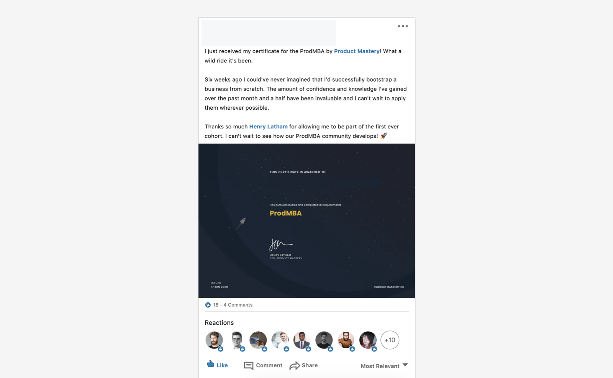
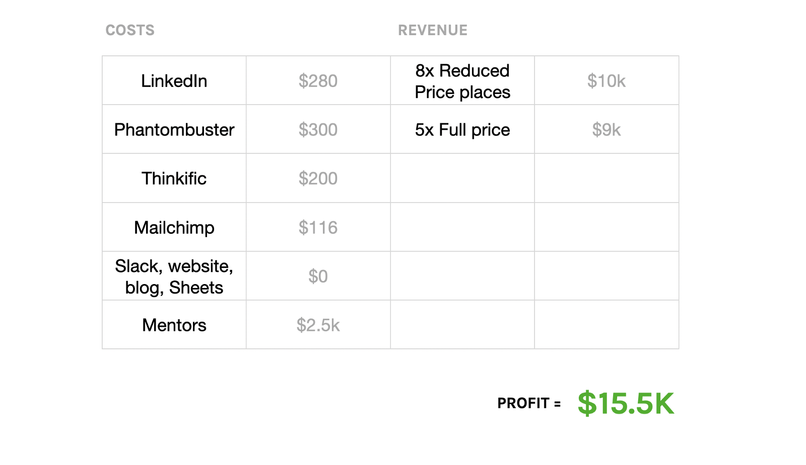
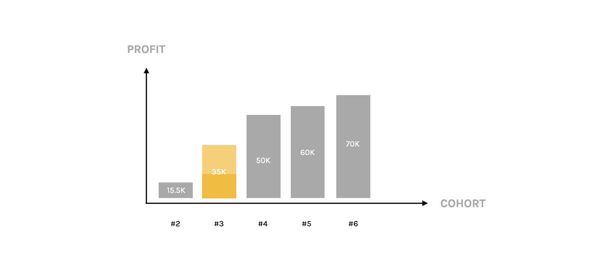
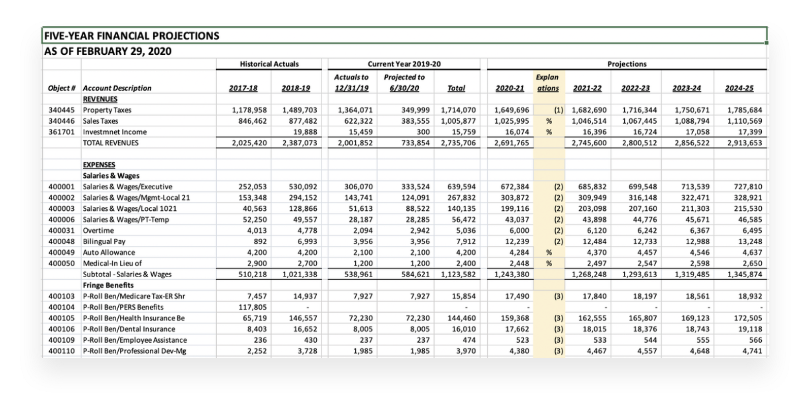
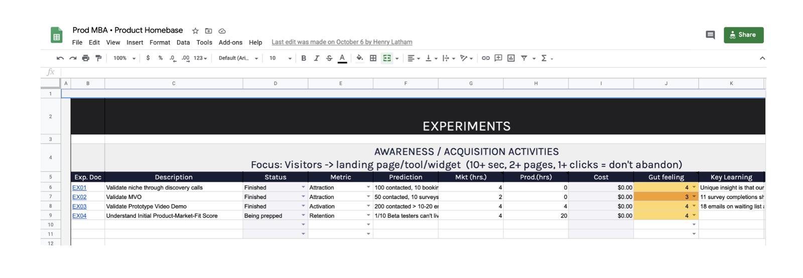
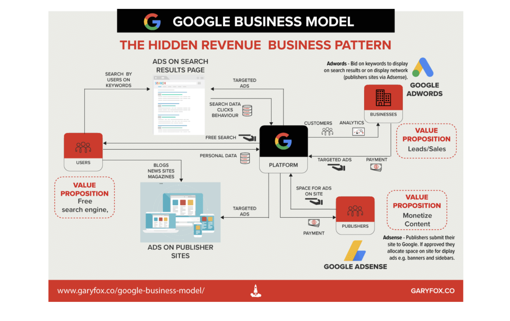
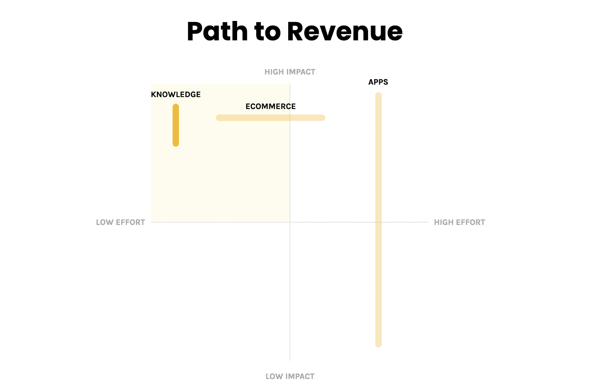
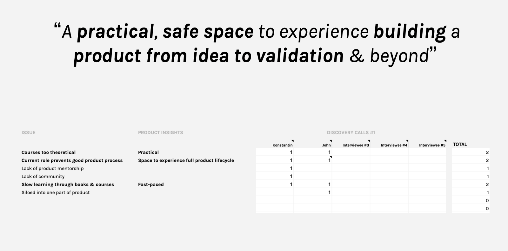
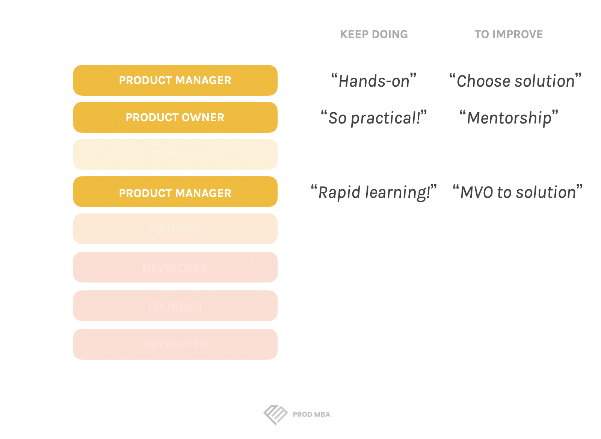
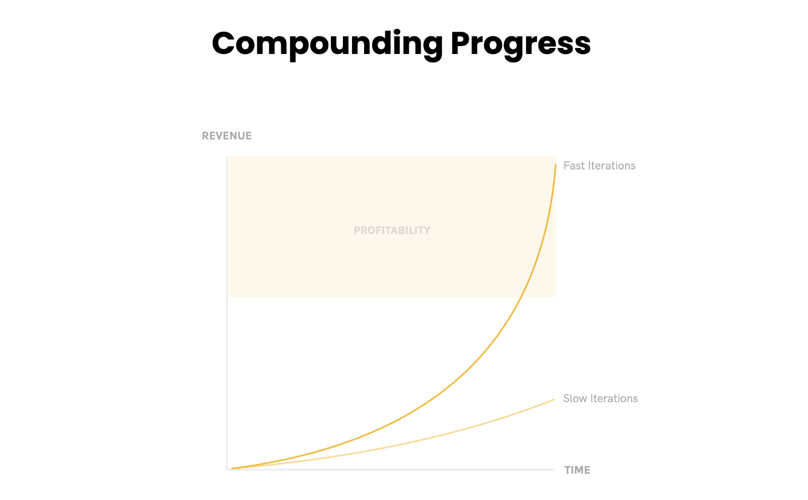

When I was planning this article, I found myself wondering:

**When does a business really start?**

Should I start counting from the day I spent £15 to incorporate my company?

Or the day I spoke to my first target customer?

Or validated there was interest in what I was offering?

Or, in fact, only when I made the first sale?

When I talk about my journey bootstrapping a business from zero to profitability in 4 months, the "4 months" part of it is not really accurate, you see.

Because my journey towards that moment - achieving profitability & therefore securing the long-term future of the business - started nearly a decade ago.

<figure class="" style="min-width: 100%;">
	
	<figcaption>BackTracker, my first business</figcaption>
</figure>

## My Origin Story

When on a solo trip in the Brazilian Amazon back in 2012, I decided to start my first business, BackTracker.

2 months later, when I got back to the UK to really start building that business, I realised I had absolutely no idea what I was doing.

We made every mistake possible, driven by ego, instinct, a complete lack of product strategy, complete lack of process.

After 2 years - and a lot of failures along the way - that business failed.

In the aftermath, feeling a lack of purpose & trying to work out what had gone wrong, I remember asking myself:

*What makes some products succeed, and others fail?*

Over the last 8 years, I've been obsessed with trying to answer that question, working as a product consultant and founder to understand - and experiment with - the factors needed for product success.

That journey has led me across 3 continents & to work with countless companies in the search for answers, culminating in the publication of my first book in 2019, Why Your Startup is Failing.

I'd like to think I've learnt a lot of lessons along the way - some of which I will be sharing with you shortly - & realised product success depended, in large part, on factors that are largely over-looked in any traditional MBA or product course.

Now, I provide value by teaching others how to engineer product success as founder of the Prod MBA, a 6-week, hands-on training programme for aspiring product managers & product owners to fast-track their path towards Head of Product.

<figure class="" style="min-width: 100%;">
	
	<figcaption>Prod MBA, the company I bootstrapped from zero to profitability as a solo-founder, in 4 months</figcaption>
</figure>

So, although my journey towards building a successful business started nearly a decade ago, this specific business is still very young.

Did it start just 4 months ago? Well, yes and no.

Back in November 2019, I had decided it was time to start my own business, so started reducing my product consultancy work to create time & focus for what that business might be.

So I started with a hypothesis:

That, as more startups start to work remote, the nature of HR in these companies changes, away from office & payroll management towards professional development, mentorship, psychological support.

And that HR professionals were unequipped - unsure even - of how to approach this.

So I started speaking to remote HR managers, as well as remote team managers.

From 10 conversations with this group, it struck me that most of those interested in finding a solution were remote product managers.
So I decided to simply scrap any hypotheses & speak to 10 more remote product managers to understood what the core frustrations seemed to be with them.

And from those conversations, a hypothesis formed:

That working remotely wasn't the root of the problem.

Instead, it was that almost all product managers I spoke to had stumbled into their role with no formal training, nor any support structure to guide them in what they were doing.

So I carried on with these conversations, building a deeper, more clear picture of the problem space.

And as I developed a deeper, more nuanced picture of the challenges product managers felt in relation to their professional development, coronavirus hit.

I didn't really know what to do next. I looked at running innovation sprints. Going back to consultancy. Facilitating workshops.
But after a couple of weeks of uncertainty and lack of focus, I remember saying to myself:

"This thing is out of your control. Focus on what is under your control, on what will be true over the long-term & act to discover & provide value."

So I committed to trying out a training programme to help existing Product Managers & Product Owners level-up their product skills.
Through the customer interviews, I'd realised that there were two things we could leverage:

1. My insight that effective product leadership only comes from learning in practice. From experiencing the uncertainty and the trials of developing a product with little or no resources, as well as starting the process yourself - with no team to lean on, nor management to hide behind

2. That there was clearly an existing frustration with over-priced courses that only covered theory, as well as a recognition that you could read all the books & tutorials in the world, but nothing replaced the reality of product in practice

So I focused on making it hands-on, practical & a genuine challenge to overcome, by getting potential customers to develop & validate a product from scratch.

Because we were at the height of the Coronavirus quarantine, I decided not to charge for the Beta programme, recruiting 25 students from what I had identified as 3 different niches within the broad category of product people - entrepreneurs, ambitious PM/POs and traditional career path PM/POs - with assumptions about who would get the most value from the programme.

<figure class="" style="min-width: 100%;">
	
	<figcaption>A testimonial from our one of our Beta programme students, Antonia, who we've since recruited to lead our Prod MBA Women's CircleAnd, long story short, we did a surprisingly good job, with 4 students generating revenue by the end of the programme, and a customer rating of 89%.</figcaption>
</figure>

Around 10 students dropped out, but that was a great assumption to validate, as almost all came from the "traditional career path PM/PO" group I had assumed wouldn't get the nuanced approach of the programme & would, therefore, not be a great fit for the programme anyway.

Fast-forward to September - six weeks after wrapping up Cohort 1 & four months after launching the first Prod MBA landing page - and we had just achieved profitability:

We had a product that we know delivered a lot of value.

We had a value proposition which was able to attract leads & convert some to a sale.

We had a business model that worked.

Here's an overview of our costs & revenue from those first 4 months:

<figure class="" style="min-width: 100%;">
	
	<figcaption>Costs & revenue for Month 1–4</figcaption>
</figure>

Around $1,000 spent on tools for acquisition & managing the programme content.

Around $2,500 invested in our freelance mentorship & community support team.

Not a massive profit at $15,500, but that was never the goal during the first year:

**The goal was to prove we could find a specific niche, offer them a specific piece of value, sell them that value, then be able to prove we can generate considerably more money than it cost us to sell.**

I'm not a big believer in long-term planning when it comes to business, as everything is so uncertain, but, as we have currently closed just under half of our sales for Cohort 3 with 2 months to go, we can confidently say that our profit margin will double by January.

I would expect us to nearly double it again by June 2020 as we deliver more & more value, as well as leverage further signs of product-market fit & the word-of-mouth that this powers for us.

<figure class="" style="min-width: 100%;">
	
	<figcaption>Expected revenue (based on our current sales trend) for the next 3–4 cohorts</figcaption>
</figure>

Not a billion-dollar company & never going to be. But that's never been the goal.

**I always defined success as having freedom of time & money, both of which are well within sight by the end of the year.**

**And both of which I know, from experience with BackTracker, slip away from you very quickly if you go down the venture capital route.
It's still early days, but we hope it only continues upwards from here.**

So, a nice story. At least nice for me to be able to tell.

---

# 7 Lessons To Level-Up Your Product or Startup

But what's in it for you? What specific lessons would I pass on to those looking to start a bootstrapped business?

Or those working in product looking to identify new opportunities?

Or those looking to better take advantage of existing opportunities?

Let's look at 7 specific lessons learnt along the way that I believe will make you a better entrepreneur & product leader:

**Lesson 1: Ego is the Enemy**

With my first business, BackTracker, I became so blinded by the hype surrounding the business - the interest from investors, vanity metrics like number of downloads, the idea of playing the "entrepreneur" and "CEO" - that I completely lost touch with what really matters:

Your target customer and providing value to your target customer, as well as to your business in the form of revenue.

And I see ego driving mistakes in so many other organisations I have worked with.

Whether it be to spend weeks to make a feature or design absolutely perfect.

Or trying to scale too quickly, when the founder craves the attention & sense of success that comes from building "the next big thing".

Or simply not listening to your team, your employees or your customers because you are so excited & confident in what you want to build.
Remember: ego is the enemy.

It will blind you to the truth & will lead you in all sorts of merry circles, distracting you from the few things that really matter:
Building a product customers love and are willing to pay for.

<figure class="" style="min-width: 100%;">
	
	<figcaption>A traditional 5-year business plan</figcaption>
</figure>

**Lesson 2: Don't Hide Behind Plans**

Traditional MBA programmes will start with some sort of business plan.

A nice 20-page document outlining the business model, the operating model, the expected costs, the expected revenue. A clever, complex strategy for leveraging user data & AI to generate revenue.

All projected over 5 years with these nice, big growth curves & huge profit margins.

And, if you speak to investors, they will even encourage you to work on this, so you have something impressive-looking to show to them that they feel they can make sense of.

Yet, particularly at the beginning, but also true of established products, this is all one big waste of time.

Because we can never predict the outcome of our work - particularly when we are unsure of our target customer, what value we could provide to them, and how we might deliver that value - it is completely pointless making any sort of concrete projections.

Each conversation with a customer, each new competitor we discover, each idea we try to validate, will move us radically away from where we started, even when we feel we might deeply understand our customer already.

Look at the example of the Prod MBA: our target customer was initially remote HR teams. Then remote product managers. Then product managers. Then frustrated Product Managers/Product Owners who feel unable to level-up their product career.

Yet worst than being a big waste of time, any sort of detailed planning is a distraction. An emotional crutch, even.

It will provide you with a sense of control over the future that is an illusion.

It will provide you with a sense that you are progressing and moving towards success - because it feels and looks like work - that is also an illusion.

Instead, we must simply get out into the real world with a skeleton plan, gather feedback, learn from that feedback, then iterate and try again.

<figure class="" style="min-width: 100%;">
	
	<figcaption>4 Steps of Product Development</figcaption>
</figure>

Because if we are unable to prove that we have a niche with an acute problem to solve, that we are then able to attract that niche to an offer, that we are then able to activate that niche to use our product, then actually convert them to a customer, before then delivering value to them, we do not have a business.

We have a nice-looking powerpoint presentation.

We must obsess over achieving Offer-Market Fit, then Product-Market Fit & cut the distraction of everything else.

Everybody has heard the famous phrase, 'Fail to plan and you plan to fail'. I don't suggest just randomly speak to anyone & everyone with no plan.

But your planning should be limited to writing down a few hypotheses & what you will do to validate each hypothesis. It can be as simple as this:

<figure class="" style="min-width: 100%;">
	
	<figcaption>The Prod MBA Product Experiments Template we used ourselves to manage product iterations & acquisition experiments</figcaption>
</figure>

So don't hide behind your plans. They won't help you succeed. They will only help you hide from the uncertainty & fear of failure that will always be there when you try to come up with something entirely new.

## Lesson 3: Your job is to mitigate risk, not reinvent the wheel.

We always try to over-complicate things.

The trend at the moment - in any modern business training, in the kinds of companies that raised investment, in the startup narrative of what "success" is defined as - focuses on the new version of the business model:

The digital business model.

<figure class="" style="min-width: 100%;">
	
	<figcaption>Google Business Model</figcaption>
</figure>

We think a business - or new product - must necessarily be really complex & clever to succeed, like Google's, with distinct free products funding different B2B product models that leverage the B2C customer base to fuel growth through AI, etc., etc.

Yes, if you want to build a billion dollar company really quickly - for example, Alibaba spin-off Ant Financial over took American Express within 4 years of launching - then you should go and do a multi-year MBA programme to look at these kinds of case studies in detail.

If you are a mere mortal like me, then keep things simple.

If, however, you are a mere mortal like me, then keep things simple & remember what your role as a product lead really is:
To mitigate risk. Specifically, that means:

1. Value risk: Are you offering something people want?
2. Feasibility risk: Are you able to deliver on your offer?
3. Usability risk: Are they able to access the core value of your offer?

This means, when it comes to your solution, really thinking through how best to solve your customer's problem in the real world, in a short window of time, rather than just jumping straight to thinking. "We need an app!".

<figure class="" style="min-width: 100%;">
	
	<figcaption>Potential effort & impact of different product solutions</figcaption>
</figure>

If you're building a digital application, the impact and value created can be massive, but it could also be zero, because of the long development cycles, the difficulty in getting to a point where you are viable & create some value, and the massive cost of even getting a basic prototype out the door.

Maybe that means working on a no-code prototype instead.

Or looking at a low-effort, potentially high-impact e-commerce product solution.

Or leveraging your knowledge as a consultant or teacher so you can rapidly deliver value, rapidly iterate & rapidly move towards profitability without getting stuck in the weeds with questions of feasibility & gathering all the necessary expertise with a large team.

## Lesson 4: Mitigate personal risk.

Whether you are bootstrapping or not, this is such an important lesson to learn.

I have an old phone with a cracked screen. I have a cheap bike I use to get around. I live in a pretty small apartment compared to many of my friends.

Now, I earned well when I worked for others. As a product consultant & freelancer, I could command a very good hourly rate.

Yet, for the last 8 years, I knew that I would build towards launching my own business. And I knew that that business would take time to get up on its feet.

So I saved. I learned how to invest. And I cut down my costs.

We own our apartment. I don't spent money on public transport. I don't spend money on many material things.

I don't, to be honest, care for material things - apart from books, which are packed away in this picture, as we are moving back to the UK.

<figure class="" style="min-width: 100%;">
	
	<figcaption>My bootstrapped office space up until Nov 2020</figcaption>
</figure>

Firstly, that lack of interest in materialism makes me a more happy person.

But secondly, it has meant that I have been able to save enough so that I have the freedom to make my own decisions.

It's meant I have been able to say: I am going to focus on building this business & not worry about bringing in income for 2020.

It's meant I've been able to turn down contracts in the past when they don't align with my beliefs or with my path for personal & profession growth.

It's meant I can make calm, objective choices free from fear of where the next pay cheque is coming from, or of needing to mortgage my house, or feed my family.

It would have been easy to spend. To say we need this. We need that. We need more space. We need a better location. We need to eat out more often.

But it's meant an investment in myself that has started to really pay off (and, in fact, means we are now able to find our dream home).
And I believe that the calm, clarity & focus that came from bootstrapping my own life has been an essential foundation for building this business, as well as simply living a happier life.

## Lesson 5: Obsess over delivering your unique value.

The biggest threat to product success is lack of Product-Market Fit.

I.e. building something that nobody loves using & doesn't bother telling other people about.

And this always comes down to a lack of understanding of exactly what specific value you are there to provide for your customer.
Usually, too broad a target customer. Too broad an offer. Too broad a solution.

All of these lead to building a generic product for an unspecific audience &, ultimately, a group of users that just don't really care about what you're offering.

With the Prod MBA, we have been obsessed from Day 1 in understanding:

1. Who, very specifically, our target customer is
2. What value they desire
3. How we can best deliver that value to them

<figure class="" style="min-width: 100%;">
	
	<figcaption>The Prod MBA Product Vision Template</figcaption>
</figure>

Our initial research revealed a frustration that Product Managers & Product Owners felt unable to grow in their career. They felt stagnant. Stuck.

We saw also that they felt courses & books were to theoretical.

So we crafted a product vision statement from this feedback around being "practical", a "safe space", "an opportunity to build a product from zero to validation".

For a certain type of Product Manager/Owner at a specific time in their career & at a specific point of personal frustration.

And when we looked at positioning & packaging - and actually when we built our solution - that's what we focused on.

<figure class="" style="min-width: 100%;">
	
	<figcaption>Feedback from our High Experience Customer (i.e. those specifically in our target niche who we know will get massive value from the Prod MBA and who, therefore, we double down on acquiring & delivering value to)</figcaption>
</figure>

And now, when we receive feedback from our students, we focus just on our ideal target customer, and double down on things we are doing well - "hands-on", "practical", "rapid learning" - and look out for things we could improve upon within our area of value, ignoring the thousand other things we could be doing.

Because, if we didn't, particularly with a very small team, we would end up with something generic. Something for "everyone". And we would end up attracting, converting & delivering value to no-one.

## Lesson 6: Focus. Focus. Focus.

Building on the point above, you must be so laser-focused on the few things that are important.

I only added a proper logo a month ago. We still have old copy & logos on some of our public pages.

My articles have typos & sloppy images in them.

But I don't care. I just focus on shipping.

And when a team member now comes to me saying, "we could do this or that", if it doesn't tie into our core value, I'll just say no.

If I stopped to worry about all the tiny things, I would forget to worry about the big things, and I'd never get anything done.

Nothing matters apart from understanding your target customer, learning how to attract your target customer, learning how to sell to your target customer, learning how to deliver a lot of value to your target customer, then converting that to value for your business in the form of revenue.

If you deliver a lot of value, they won't care if there's a typo. Or if your videos aren't world-class. Or that your branding is underwhelming.

But if you don't deliver value - and a lot of value - then it doesn't matter how nice your website looks or the balance of your colour palette. You won't have any customers to see it.

<figure class="" style="min-width: 100%;">
	
	<figcaption>Compound progress curve</figcaption>
</figure>

Finally, remember the value of compounding interest: The slower you are in running an experiment, reviewing the results, then learning what happened & trying again, the slower your path to profitability and/or growth.

So forget the little things. Focus instead only on what matters.

## Lesson 7: Return to first principles.

I'm actually annoyed with myself for even having written this, but here you go:

Back in March, whilst I was still exploring possible offers & solutions for our target audience, I wrote the following in my daily journal:

*"It would be too hard to differentiate us with a PM course. There's not enough impact with a course."*

Because when I thought of course - or any sort of training - I imagined what all my students imagined before the Prod MBA:

Paying a lot of money to watch a load of overly-theoretical videos on product that you'll never act upon, taught by some white guy from Silicon Valley who has worked in Google or Facebook in one niche product team in one properly product-led organisation.

Yet, when I caught myself and reviewed my thinking again, I simply asked myself:

What does it really mean to learn? And what is the desired outcome we look for with a course?

And it became clear that the core motivation for most people signing up for a course is not because of the fact it has videos, or that it is even offered by an accredited university.

They sign up because they want experiential learning. They want to understand what they should be doing as a product leader & actually experience what that is like in practice.

They want to truly feel like they are growing.

And that made me realise:

**We don't need to offer a course. We need to offer a true experience, then shape the solution accordingly, leading to the unique approach of individual, hands-on work, combined with mentorship & the peer support of a cohort, that we offer today.**

# Recap

1. Ego is the enemy
2. Don't Hide Behind Plans
3. Your job is to mitigate risk
4. Mitigate personal risk
5. Obsess over delivering your /unique/ value
6. Focus. Focus. Focus.
7. Return to first principles

And if you want the specific tools & tactics I developed to help us get to profitability for each of these lessons, you can try our free 7-Day Mini MBA below to get started:
