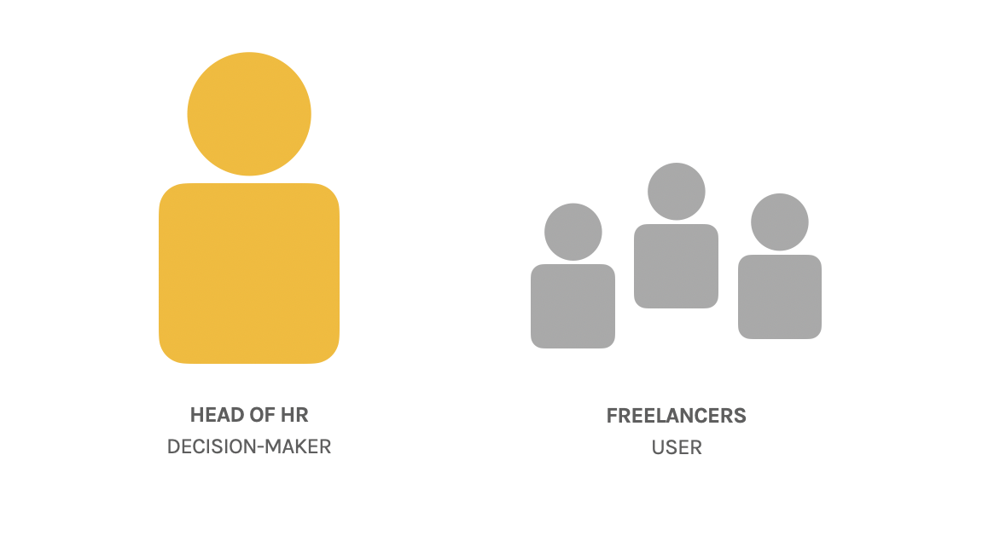
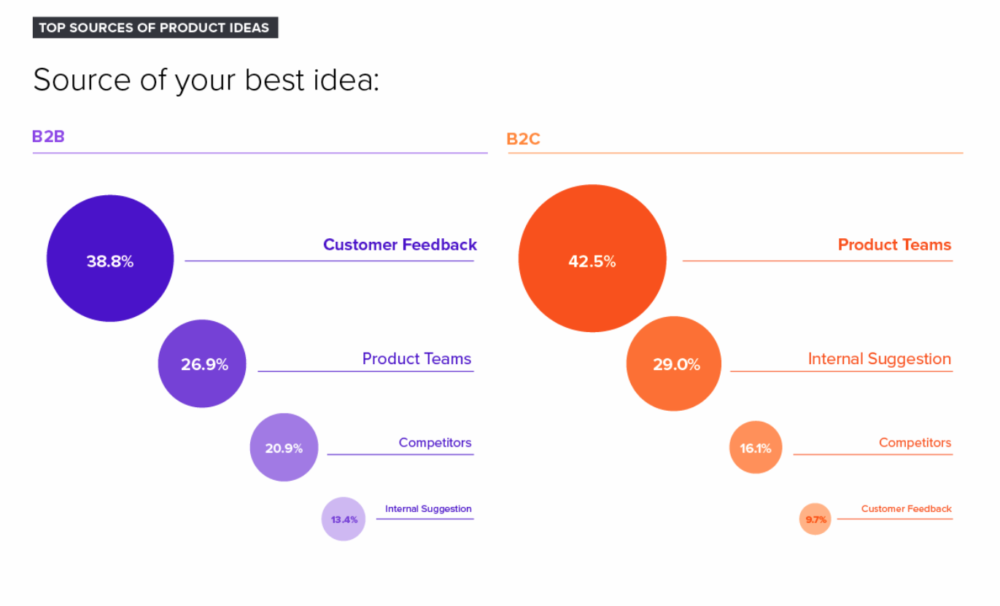
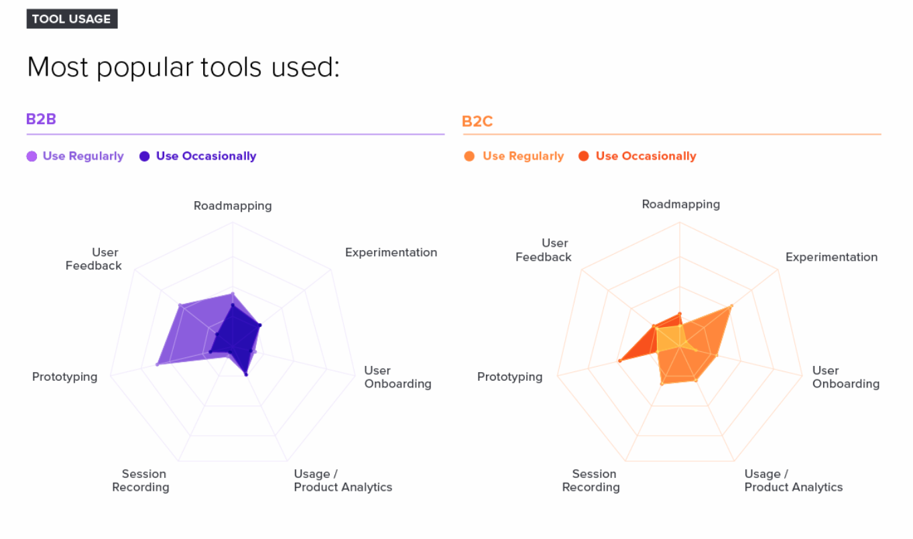

It’s commonly accepted that the role of a B2B Product Manager is very different from that of a B2C Product Manager.

That, dealing directly with businesses - what we call B2B or business-to-business - requires a different skill set & priorities than dealing directly with products selling directly to individual consumers (what we call B2C).

But how true is this?

What are the specific differences?

And do those differences require a fundamental shift in how we approach a B2C v. B2B role?

Or are they simply low-level differences that require us to understand them, but not pay too much attention to them?

A growing body of literature in the marketing space, due to technological innovation & the changing mindset of individuals within businesses, suggest that the two are becoming more & more alike.

In the following article, I will argue that yes, there are differences between B2B & B2C product management.

That each role presents unique challenges, looking at the role of the decision-maker versus the user in B2B, the role of customer insight & the unique sales challenges of B2B.

However, I will also argue that these differences are not as big as you may think - or that you may be led to believe.

That we have created an artificial - and unhelpful - demarcation in our heads between “people” and “businesses” that no longer makes sense.

And that, ultimately, the fundamentals of both roles are the same:

It’s still really about dealing with humans.

Of focusing on validating a product strategy (which problem to solve, for whom, how best to solve it, how to make money from it, etc.) & of an ongoing process of building, measuring & learning from each iteration of our solution.

I will then conclude that, for those working in B2B, we should be aware of these differences, but that they should not distract us from the core of what our role is, wherever we find ourselves operating as a Product Manager:

Creating value for our user and/or customer, as well as capturing that value - in the form of revenue - for our business.

 

### The Decision-Maker v. The User

The first challenge unique to B2B is the fact that you are dealing with two different actors:

The decision-maker, who will make the ultimate decision on whether to engage your product to help their organisation achieve a specific job-to-be-done.

The user, who will be using the product.

For example, you may have the Head of HR (the decision-maker) engage a product for the company’s freelancers to track how many hours they work each week, but ultimately it will be the freelancer (the user) actually using this tool to add their hours, track the total & send that as a report to the Head of HR.

In many cases, the decision-maker & the user are in fact the same person.

Most buyers nowadays tend to search out their own solutions. Or they may be, for example, a department head buying software for their team, but will do so as a user themselves & in agreement with that team (rather than imposing a new product on them without consultation).

However, there are almost always other stakeholders to consider in any decision to work with a new product.

HR, for example, might engage the freelance hour-tracking product, but will also want to access reports on that product. Senior management might want to do the same to understand what the freelancers are working on. Finance might want to audit those hours & have transparency on freelancer costs.

Furthermore, another challenge of dealing with two different actors is that it is not uncommon for the incentives of these two players to come into conflict.

Firstly, we see in many cases the user experience sacrificed in an attempt to please the decision-maker, as they are the one who will ultimately pay for the product.

Decisions are therefore made to please the buyer - and make the sale - rather than on the user, who has to put up with a clunky user experience at times.

Enterprise tools built by companies like Oracle & SAP use this strategy, simply trying to keep customers locked in through an effective sales strategy, rather than trying to build the most user-friendly, innovative technology.

Secondly, a lack of support from the decision-maker can mean a great product is never adopted, or undermined when it is adopted.

Productboard would be a great example of this:

A tool that helps Product Managers pull in customer feedback on a continuous basis & define strategic objectives is great - in theory - as it would help make data-driven product decisions.

However, if there is no support from leadership to become more product-led, the tool is simply not going to help decision-making in practice.

## Unique Sales & Marketing Challenges in B2B

The second challenge unique to B2B is that of marketing & selling the product.

#### Education, Don’t Entertain
Firstly, it is commonly accepted that those looking to engage your product as a business want to be educated, not entertained.

This means more content for marketing, such as sales webinars, as well as more involvement from sales & marketing in the onboarding process & strategy for raising awareness & acquisition for the product.

Furthermore, it means there must be much more education baked into the core product itself. Beyond just onboarding, on-going education, such as educational “How to” blog posts & free ongoing demos & trainings. Hubspot is a great example of these kind of tactics in practice.

#### Long Sales Process
Secondly, the marketing & sales process in B2B takes a lot longer from the creation of a lead (i.e. somebody showing interest) to conversion (i.e. closing a sale).

There is a much longer buying cycle, where the decision-maker may have to await a new quarterly budget, or check-in with their team to determine whether the product would in fact be something they use, or check with management to see whether there is budget & to get final approval.

At Prod MBA, for example, a buying decision from a B2C customer is usually made on the application call, whereas some B2B customers can take 8 months to commit to sale.

Linked to that longer sales process, part of the challenge is also that of different buyer expectations:

1. When a B2B customer pays for a product, it is common for that sale to be made with certain demands: that they are only going to pay for the product if Feature A is built, or that Feature B be improved immediately.

This can be a positive, as it means we are constantly gathering feedback from our customers about their priorities, but it can also lead to the downfall as a product:

Trying to build every feature for every single customer, regardless of the value of that feature, bringing added complexity & moving us away from a coherent product vision & product strategy.

2. Add to that the fact that some customers have disproportionate influence over decision-making with, say, one customer representing 30% of our revenue, and it’s easy to simply build everything that one customer demands.

3. Finally, there is also the expectation from the decision-maker that there will be some sort of visibility over the roadmap, to understand what new capabilities are on their way, as well as to try to influence that roadmap. This can create problems, as the visibility of the roadmap means we are more likely to see it as a concrete, fixed to-do list, rather than something that should evolve & change as new data comes in

#### B2B Relationships Are Built Over Time

The final unique challenge of sales & marketing in B2B is that fact that, in many cases, sales professionals are using their network to generate sales.

These are usually relationships built over years in the industry.

Over decades, in many cases.

This means that relationship - as well as the sales professional’s reputation - is on the line when a buyer commits to a sale, adding pressure on the product team.

Why? If the sales professional’s reputation is on the line, they are going to work hard to make sure any demands or feature requests are squeezed into the product roadmap as urgently as possible.

## B2B Leverages Customer Insight Differently
The third challenge unique to B2B is how we use data from customers to inform product decisions.

#### Customer Insight Coming From Sales
Firstly, much of our insights about what the customer wants - & how we might best deliver value from them - will come from our sales professionals.

They have a lot of direct customer interactions. Data-rich, regular conversations with the customer about their challenges & how their business operates.

Rather than simply ignoring this, as PMs, we can use this to our advantage:

Leverage the data through tools to gather qualitative data, such as through a simple Typeform the sales team should fill in after every customer interaction, or through looking at the notes made on each customer profile & engagement on your sales tools, such as Salesforce or Pipedrive.

Furthermore, beyond just how to gather that data on a practical level, another important consideration is actually getting them to gather that data for you!

That requires you to cultivate a strong relationship with your sales team. They need to trust you. They need to understand why your product roadmap won’t change based on every single request, or why it’s so important they fill in a short survey after every customer call they have.

#### Less Data in B2B
Secondly, when it comes to customer insight, with B2B we tend to simply get much less of that data.

Unlike B2C, where we might get millions of new users per day, in B2B, where we might only have 10-20 customers (or a handful of new customers per week), we can’t rely on quantitative analytics data to determine what customers are really doing - and why.

Particularly as much of those interactions will be informed by different educational content, or help from customer support, distorting this data.

Instead, we must rely a lot more on qualitative data: On aggregating the conversations and interactions of our sales professionals & customer support into common themes & problems that, once prioritised based on expected impact, we can then address with new features and experiments.

#### Slow Iterations
Finally, unlike B2C where we might iterate our product every few days, B2B customers can in fact be hostile to too much change. That means that - add to that the fact that B2B user flows tend to be more complex - we have to spend more time testing & rolling out new features than we would in a B2C environment. A knock-on effect of this is that it also means we get less data, at longer intervals, to understand the impact of each product change.

<figure class="" style="min-width: 100%;">
	
</figure>

## Why The Fundamentals of B2B & B2C Are The Same

Despite the challenges of dealing with the decision-maker versus the user in B2B, the unique sales challenges of B2B &  the different role of customer insight, the fundamentals of a B2B & B2C Product Manager are essentially the same.

It has for decades been commonly accepted that B2B decision-makers are rational actors, and that B2C decision-makers are emotional.

That one acts like a robot, the other like an irrational, emotional human.

And that, as such, a B2B PM should only bother with rational arguments & comprehensive workflows, with a B2C PM just bothered about brand & an entertaining user experience.

#### We Are Dealing With Human Decision-Makers

Let’s be clear: No human is a rational actor.

They may make rational arguments to themselves, or to other stakeholders, to justify a purchasing decision. Ultimately, however, decisions are driven by emotions.

If you doubt this, think of any manager or leader you’ve worked with. Have all their decisions need clearly rational?

Beyond the vast wealth of research on decision-making, there are two specific studies to support this argument in the context of B2B decision-making:

Firstly, [a study conducted by Harvard Business Review](https://hbr.org/2018/03/the-b2b-elements-of-value) identified 40 fundamental “elements of value” in B2B decision-making. Yes, considerations such as price, specifications or regulatory needs played a role. However, according to the authors, “…considerations such as whether a product can enhance the buyer’s reputation or reduce anxiety play a large role.”

Secondly, [a 3-year study by Deloitte Digital](https://www.deloittedigital.com/us/en/blog-list/2019/we-re-only-human--exploring-and-quantifying-the-human-experience.html) backed up these findings, when concussing that products creating a “human experience” (e.g. aligning to the values of their customers, workforce and partners) were twice as likely to outperform competitors in terms revenue growth. They also experienced 17 times faster store growth.

As HBR concluded themselves, there is a real mix of objectives - sometimes conflicting - which drive decisions, however rational & objective we may treat businesses.

#### Dealing With Humans Means Understanding Their Needs

As we are dealing with humans, we can’t simply listen to what they tell us.

Instead, as PMs, we need to understand who they are, specifically, as well as what their deep needs & frustrations are, so we can determine how best to help them achieve whatever desired outcome it is they would like to achieve.

I will go into much more detail on the process of creating - and acting upon - deep customer insights in future blog posts.

Suffice to say, as with B2C, this means that understanding & serving the customer should lie at the core of every decision we make as a Product Manager.

That should translate to, on an organisational level, different product teams focused on serving different personas, or different parts of the product process.

For example, one team focused on the process of acquisition (how we attract & convert a user), and another focused on activation (how we onboard a user).

Each team should be multi-functional, with the ability to act autonomously, with skills across marketing, development, UX/UI design, data & product - even sales in some cases.

Each team should also have a clear objective to achieve, such as “improve the onboarding experience”, with corresponding, measurable key results, such as “reduce time from sign up to live demo from 24hrs to 1hr” and/or, returning to our freelancer example, “increase percentage of new users who track their hours worked today from 20% to 60%”.

Again, more on team topology & the OKR framework in future blog posts.

The only slight nuance here is that, in B2B, you may find it harder to attribute “Customer success” to one specific team, due to the overlap of educational content & hands-on support that a B2B customer would get.

For example, did that customer complete the onboarding easily because a customer support member was on the phone with them? Or that the user experience was easier? Or that their sales professional had talked them through how to do it beforehand?

#### All PMs Need to Validate Their Product Strategy

I will go into a lot more detail on this in future blog posts, but thought it worth mentioning:

As a B2B PM, there may be a temptation to simply build what is in front of you: What sales professionals are telling you customers want, or what those customers are telling you to build themselves.

The temptation can even be the same for B2C PMs with many customers, as a lot of data starts pouring in from support ticket requests or surveys about what customers say they want.

However, as an effective PM, we need to be careful how we handle that data.

We should never forget the fact that we should have a clear, compelling product strategy in place stating clearly who our specific target customer is, what they ultimately want to achieve, and how we believe we can best deliver that desired outcome in a unique, valuable way.

If for example, we return to our freelancer time-tracking example, say we believe that “simplicity” and “speed” are by far the most important factors to pursue.

Say that the competition does not do these things well, but we determine, from customer interviews & insights, that, if we made a product really simple & really quick to engage with, they would love it.

Firstly, we need to validate that these are in fact things our customer would value, with something called an MVO (Minimal Viable Offer), where we may run Facebook ads funnelling leads to a landing page to see whether they engage with it:

With a statement highlighting these points of value, such as “We help busy freelancers track their daily work with just 10 seconds per day”, on a simple landing page with an email signup form.

If we validate that more than 5% of those leads are actually signing up, we can get an indication that yes, speed & simplicity are in fact what we should focus on.

In such a case, we should stay laser-focused on these two points of value, not getting distracted by new ideas or suggestions from sales or the customers themselves.

If we do get distracted, we end up with a generic, bloated product that becomes difficult to use & difficult to even understand what, specifically, its value is.

#### All PMs Need To Validate Each Solution

Similarly, as PMs, we need to validate every product decision we make, not just our product strategy.

That means a consistent process of determining what we want to build, prototyping it, testing it out with customers, measuring the results once it is launched, then learning from the outcome i.e. did it deliver the expected value?

Despite the common belief that B2B PMs simply build what sales or customers ask of them, the data here is surprising:

According to [one study by Pendo](https://www.pendo.io/state-of-product-leadership/), customer feedback is in fact the most common source of product for B2B product leaders (39%).

<figure class="" style="min-width: 100%;">
	
	<figcaption>Common sources of ideas</figcaption>
</figure>

In contrast, B2C product leaders only use customer feedback 10% of the time.

When it comes to solution validation, it also seems that B2B Product Managers listen to their customers more:

“A majority of B2B product leaders (54%) say they use a user feedback collection and/or management tool regularly, making it their second most used tool (behind prototyping tools, 63%).”

<figure class="" style="min-width: 100%;">
	
	<figcaption>Common sources of validation</figcaption>
</figure>

Why am I showing you this data?

Simply put, to show that, regardless of your role, there is no excuse to not interact with the customer at every step of the journey, from ideation through to testing out a prototype or validating a final solution.

Ideas should be generated from customer feedback & customer interviews to generate customer insights.

Those ideas should be tested in a paper prototype, or a realistic-looking prototype built in Figma or similar.

That prototype should be iterated upon until it seems feasible, viable & usable.

It should then be tested when it has been built.

The results should be tracked, whether through analytics data in B2C, or through user testing in B2B once it goes live.

And we should review the learnings: Did it deliver the expected value?

## Conclusion
As with everything in product, everything is complicated.

Everything is nuanced.

On the question of how we should approach product management in B2B v. B2C, there are differences. There are nuances.

These are differences that have important implications.

For example, if we understand that customer insight will come from our sales team & that quantitative data is largely useless, it changes how we should approach gathering data to inform our product decisions.

However, these differences should not distract us from our core _raison d’étre_ as a product manager and a product leader:

To deeply understand our customer.

To serve that customer with the best solution possible.

And to remember that they are humans driven by emotion, desiring something, that we are there to help deliver.
