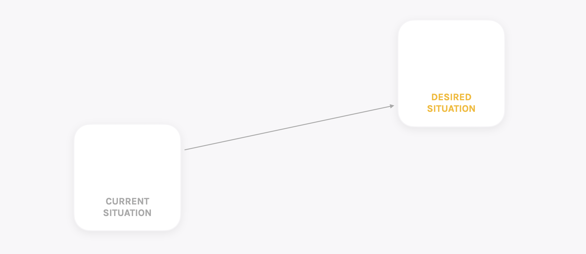
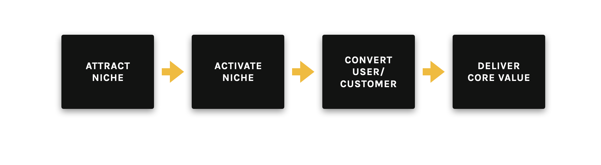
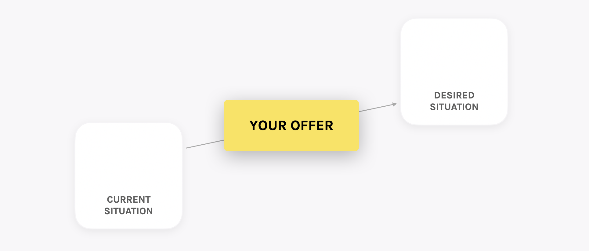

We tend to think of “a product” as something digital, something with a set of features, something that helps somebody do a thing.

We all have an intuitive _feel_ for what a product really is:

> “A product. Yeah. I get that.”  

Yet, is our intuition really that accurate?

In the following article, I will argue that product has nothing to do with being digital or features, looking at the root causes of why this myth is so common in the product world.

I will then argue that product is something entirely differently:

That product represents a _transformation_ for a specific target customer with a specific outcome they desire.

And that, for product leaders who understand this, it will radically improve the impact you will have with any product you build.  

## A Void of Direction
After speaking to hundreds of Product Managers & Product Owners, most tend to tell me their main challenges are:

1. Prioritisation
2. Stakeholder management.

I.E. they don’t know _what_ to work on, or can’t get what they think the team _should_ be working on approved.

Yet these are just the consequences of a far greater problem:

When many companies build - or manage - a product, they get the basics all wrong and forget to ask this essential question:

**What are we trying to do, specifically? Why? And for whom?**

They look at the competition and try to base decisions _off_ them.

What features do they have? What can we copy? What should we not bother with? How do we do a better, more simple, more enjoyable version of them?

We end up with a slightly different, but essentially similar, product.

And because we start by copying… We carry on copying.

Always one step behind.

Now copying does work, for a while…

#### Lack of Direction Leads To Chaos

Yet, ultimately, it will lead to chaos & failure.

Why?

If we never start with a clear vision of what we want to change in the world - nor for whom - there is no idea of really why we are doing everything in the first place.

This means there is no alignment over what we want to achieve, specifically, nor for whom.

This lack of alignment creates chaos, as everything is open to interpretation & sort of doing your own thing.

One founder thinks the organisation is doing one thing. The other thinks the organisation is doing another. And the Product Manager is off doing their own thing trying to work out what they probably _should_ be doing.

And as the company grows, this misalignment and miscommunication just makes things more chaotic.

 

Leadership has no idea what they want to achieve on a high level…

So they try to just do EVERYTHING imaginable… Or copy all of the features… Of all of the competition.

And because they try to build everything for everyone, they end up with a mediocre, over-engineered, feature-heavy product that nobody is interested in using.

And you, as the Product Manager, find yourself in a Feature Factory, just shipping _more_ features as _fast as possible_.

They try to boost growth by spending a load of money on sales & marketing, scaling too quickly & spending too much, pushing a product that just isn’t all that good.

And, without a clear focus for your product work, you - as the Product Manager - find yourself over-worked, frustrated, just about getting one task rushed through only to immediately start on the next one.

Leadership have given up trying to be strategic and just put pressure on you to deliver more, more, more. More features, more speed, more developers.

You’re expected - and even incentivised - to just deliver more and more features, faster & faster.

But they forget the one thing that really matters:

**Building just a few high-quality features for a very specific type of customer & doubling down on _those_ features that this _specific_ group of customers love about your product.**

Yet it is essential to remember what the essence of your product role is:

That a product is there to deliver value for the customer and to deliver value for the business in the form of revenue.

And that _your_ role as a product leader is to make sure that this happens.

It is not to hit your sprint target or deliver loads of features or to please your CEO’s latest, untested idea.

#### The Product Death Spiral

And if we don’t turn things around, it becomes a death spiral, with big, expensive development teams burning through the company’s money.

And a continued spiral of chaotic, poor decision-making.

## The Dangers of Scrum Being Misapplied

As well as a lack of product vision & strategy leading to chaos, the Feature Factory is further supported by the misuse of Agile and, specifically Scrum, as a methodology.

When people are faced with uncertainty & stress - or simply not understanding the true nature of a thing - there is a general rule that they will grab onto a quick, simple solution to solve the problem.

That simple solution tends to be Scrum.

#### What is Scrum?

For those new to product management, a little bit of background on Scrum:

In the early 2000’s, the concept of “Agile software development” - usually just termed Agile - emerged as a response to the traditional approach to software development, where features were defined, documented, then delivered months - or years - later looking nothing like what was planned.

It was a mess, with developers sitting - frustrated - at the end of the factory line.

In 2001, a group of developers got together to determine how to make software better, coming up with 4 key principles outlined in The Agile Manifesto:

> _Individuals and interactions over processes and tools_  
> _Working software over comprehensive documentation_  
> _Customer collaboration over contract negotiation_  
> _Responding to change over following a plan_  
> — The Agile Manifesto  

What did this all mean?

Essentially, the Agile Manifesto was a set of principles - a philosophy of sorts - to help guide teams.

_Individuals and interactions over processes and tools_so that teams & different stakeholders prioritised collaboration & communication.

_Working software over comprehensive documentation_ to focus on delivery - actually shipping software quickly to customers.

_Customer collaboration over contract negotiation_to ensure that teams were speaking to the customer & understanding their problems & frustrations, rather than just mapping out solutions managers had come up with themselves.

_Responding to change over following a plan_ - self-explanatory.

Scrum is considered an “agile methodology”, as it is a framework for developing software in adherence to these Agile principles, with a stated focus on the creation of value for the customer and for the business…

… In theory.

#### Scrum In Practice v. In Theory

There is no actual fixed view of what Scrum really constitutes, beyond a stated desire to deliver software & value, yet in practice, we tend to see Scrum promulgated as constituting things like:

1. Specific roles within the product team, such as a Product Owner and Product Manager
2. Software delivery planned in 1-2 week sprints
3. Regular rituals, such as a retrospective or spring planning meeting
4. Measurement of output through, for example, story points assigned to specific development tasks

As Scrum.org points out, Scrum is the _“de-facto standard for how teams deliver software”._

Yet the irony is that nobody can really point to what specifically Scrum is, nor what _customer & business value_ it really delivers in practice.

#### The Product Manager & Product Owner

Scrum is also where the concept of a Product Owner came from. A person who is a proxy for the customer - who represents the customer - and passes down requirements to developers.

The purpose of many PO certifications, where people “become a Product Owner” over a 2-day workshop is to, according to the  [Certified Scrum Product Owner Certification](https://www.scrumalliance.org/scrum/media/ScrumAllianceMedia/Files%20and%20PDFs/Certifications/CSPO/CSPO-Learning-Objectives-062713.pdf)  by Scrum Alliance,

> “Teach that the role of the Product Owner is typically played by the customer, or customer representative, such as a product manager.”  

Although in theory, the purpose of Scrum’s ceremonies is to focus on a clear objective for a specific period of work - say, 2 weeks - typically, the role covers three main areas of responsibility:

* Define the product backlog and create actionable user stories for the development teams i.e. defining what might be build
* Refine and prioritise the work in the backlog i.e. decide what will be built
* Accept the completed user stories to make sure the work fulfils the criteria i.e. test that what should have been built it was, in fact, built

What this tends to translate into, when a Product Owner operates in the real world, is a heavy focus on processes & rituals. Things like:

1. Creating an organised backlog
2. Writing clear user stories
3. Planning how many tickets will be completed each sprint
4. Running retrospectives & daily standups

i.e. activities based around the optimisation of _output_ - getting more features done, faster.

I’ve heard all the arguments before when it comes to defending Scrum:

“Teams that do this are just doing Scrum wrong.” Or, “they just aren’t getting it”.

Yet the trend towards output over outcomes is alarmingly common, which suggests there is some inherent flaw in Scrum that is overlooked or ignored.

This is not to say that Scrum is not an effective way to manage software development.

It is simply to say that Scrum as an approach has been so misinterpreted and distorted to generally focus on velocity, not value creation, that we must be cautious when applying this methodology.

In many teams, Scrum creates a false sense of “doing product right” when following the rituals & makes us stop to ask:

Why are we doing all these rituals in the first place? What are they in service of? And why does that matter?

Does an organised backlog or do well-written user stories matter if the things in the backlog are unlikely to deliver value for the customer?

Does completing lots of features matter if they don’t deliver value? Or if we have no idea what the impact of those features was on the customer and the business?

Is a daily standup or retrospective even valuable if there is no deep analysis of what we are building and, more importantly, why, instead just a focus on how to build more features faster?

Unfortunately, there is a whole industry of Agile Coaches & Scrum Certifications built around teaching principles of Scrum without addressing many of the open questions & varied interpretations of what Scrum really means in practice…

A clear example from the SAFe approach:

**_In theory_**, Product Managers are meant to manage Product Owners & do all of that strategic & discovery work themselves:

Speaking to customers, defining requirements & scope, determining what might be most valuable to build for the customer & for the business.

**_In reality_**, however, how is an internal-facing Product Owner - one that rarely speaks to the customer - meant to represent the customer?

They have no context, so they inevitably just accept tasks that come their way, organise them into a neat backlog, write out detailed user stories, then just get their development team to ship those features as quickly as possible, testing everything works on the way out, with no thought about the impact of those features once released.

Furthermore, they are even _incentivised_ to make sure tickets are defined & completed quickly by their management team.

Although in theory meant to be speaking to customers up to half of their time, according to Scrum Inc, this is simply never the case in practice from my experience.

Ultimately we always come back to the same fundamental flaw with Scrum:

In the words of Melissa Perri, CEO of ProdUX & author of _Escaping The Build Trap_:

> “How do we know we are building the right thing?”  

Considering - according to one study conducted by Microsoft - up to 50-70% of the features we realise have zero impact - or even a negative impact - on our key customer & business metrics, this means we are wasting MOST of our time just working on things that are creating zero value.

Scrum can be an important part of your product toolkit - it is, clearly, important to get things done efficiently.

And this is particularly true in more established products, where we may be dealing with longer, more complex development cycles.

Yet, at this early stage in particular, where so many things are unknown about our product, we need another approach to fulfil the core purpose of our work:

**Delivering value.**

## The Role of The Product Manager

So what is the role of product management in all this?

Bad product management is focused on output i.e. _how quickly can we build these features?_

Product Management, on the other hand, is focused on outcomes i.e. _why are we building these features in the first place?_

A good product manager prioritises against clear outcome-orientated goals:

_What are we trying to achieve? Why? And how can we experiment quickly to achieve that goal?_

A good Product Manager focuses on how to discover & validate customer & business value, using a toolkit of different processes & tactics as needed to ensure that the product will succeed in the marketplace:

A product manager essentially deals with mitigating uncertainty.

Specifically:

- ✅ Value risk

- ✅ Feasibility risk

- ✅ Usability risk

**A Product Owner may be the role you play in a Scrum team - representing the customer, managing a development team & sprints to execute the work efficiently - but being a Product Manager is the overall job you fulfil to ultimately deliver customer & business value for the business.**

And a Product Leader is somebody who can go beyond this, identifying opportunities to create value, telling a compelling story to get buy-in from stakeholders, then helping each product team iterate towards taking advantage of that opportunity - but more on that in a future blog post.

Unfortunately, there’s no silver bullet to mastering product.

Things like navigating stakeholders, running truly data-driven experiments, or managing outcomes, etc., depend on the unique context of your product & organisation.

As a result, we can’t apply a “one size fits all approach”. We need to, instead, develop our personal ability to adapt rapidly, to learn rapidly and to thrive in uncertainty by learning through practice.

 

## So… What is A Product?
As Marty Cagan, author of Inspired notes:

> “It doesn’t matter how good your engineering team is if they are not given something worthwhile to build.”  

Failure to achieve product-market fit - i.e. building a product that a very specific customer persona loves SO MUCH that they would find it hard to live without it. - is **THE single biggest reason startups fail**. And a focus on output, as well as an organisation lacking product vision & therefore alignment, will never lead to achieving Product-Market Fit.

Considering this, if your company has no idea what it is building and for whom, whilst using Scrum to optimise to build more features, faster, this is a one-way ticket to a mediocre product & failure, you must act to change this.

#### Product as a vehicle for transformation

So, what is a product?

Customer & business value does not simply come from one or two good features. Or a smooth sign up process. It encompasses everything the customer touches upon:

As Jim Semick, CEO and cofounder of ProductPlan, a tool for developing product roadmaps and delivery schedules states,

> “The problem is that the product is not simply a set of features; the product is the way you talk about the product, it’s the way that you acquire customers, the sales process that you go through to actually close a customer, the experience that someone has when they’re going through that process. That’s all part of the product, at least in the customer’s mind.”  

The product is the entire experience.

 

And this is why it is essential for you to understand - not just in theory, but in practice - how each of these building blocks must be approached.

1. How we create awareness
2. How we activate potential customers
3. How we convert them
4. How we deliver the core value of our product to them

But more than that, product is a promise of transformation. It is a way of taking somebody with a pain / frustration / problem to a situation where that pain / frustration / problem has been solved.

And the more acute the problem, the bigger the opportunity for us to seize with our product offering.

 

And the offer - something we will work on defining in a future blog post - is the vehicle we position in between to take somebody who is suffering, frustrated and in pain towards living their ideal outcome.
