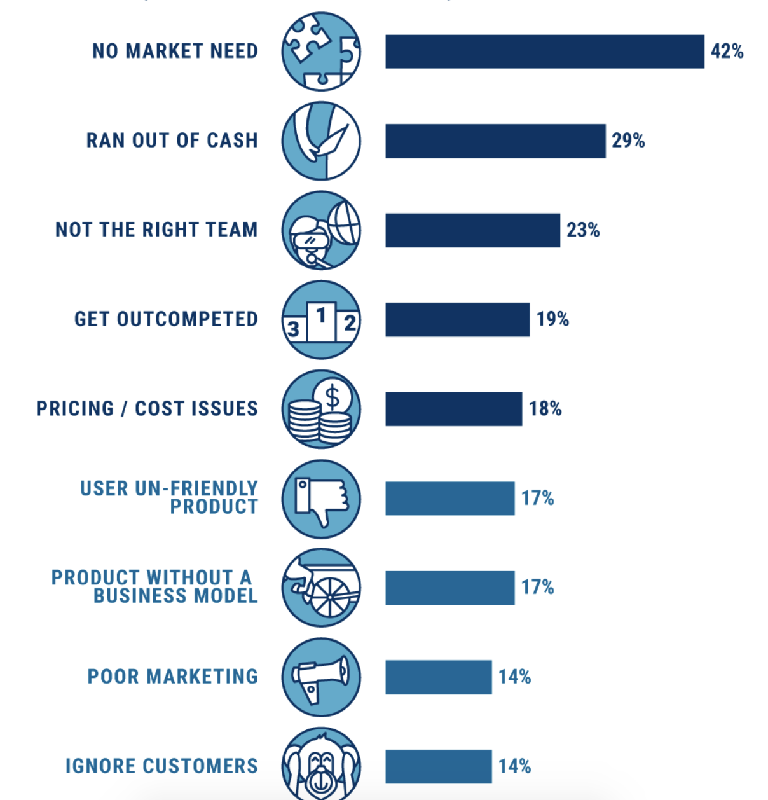

Most in the product world understand that we play a risky game.

That the failure rate is high.

Very high, in fact.

Various studies have put both product - & startup - failure rate at around 90%:

* [A study](https://www.statisticbrain.com/startup-failure-by-industry/) by Professor of Management Practice at Harvard Business School, Shikhar Ghosh, puts startup failure rate at 90-95%
* [Consultancy firm StrategyN](https://strategyn.com/2020/09/15/you-need-to-rethink-your-innovation-process/) put the failure rate of new products at 80%

Yet, clearly, the important question for us to understood is WHY.

Why do so many products & so many startups fail?

Is it that the game we play is simply one that is inherently risky?

Or are there common mistakes that - once we are aware of - we can learn from & avoid? Thus dramatically increasing our chances of avoiding failure?

In this article, I will highlight the common reasons both startups & new products.

I will then argue that, with many of these studies, we look at the symptoms - and not the root cause - of product failure.

And that, once we understand the surprising root cause of product failure, we can mitigate the risk of product failure far more effectively, armed with the right tools, frameworks & mindset to do so.

## So, Why Do Products Fail?
As there are limited studies on _product_ failure itself, as well as many nuanced factors involved in the success or failure of a product build internally in an existing company, let’s turn to the research we have on _startup_ failure to gain a better understanding of this subject.

One study, [Why Startups Fail: Top 20 Reasons l CB Insights](https://www.cbinsights.com/research/startup-failure-reasons-top/), highlights 9 common factors involved in startup failure:

Yet if we look at a more robust study, such as [the Startup Genome Report’s study of 10,000 startups from 2019](https://startupgenome.com/gser2019), a common thread is identified:

**That 74% of startups failed because they scaled prematurely.**

Scaling prematurely.

“Ok…”, we might say.

… and move on, stopping reading this article right here, as we go about our day, enlightened now about what to avoid.

Yet the interesting thing - and the real lesson we must takeaway - is that, why, despite this very common reason being understood in both investor & startup circles, do product teams keep making this mistake?

Why do they keep scaling prematurely?

As mentioned in the introduction, in the product world, as with other areas of life, we are very good at identifying the symptoms of a problem, but rarely very effective at identifying the root causes.

Let us, therefore, look at the root causes of startup - and, by extension, product - failure to understand how to really mitigate the risk of our own product making the same mistakes.

## The “Cult Of Growth”
When I started my first business, [BackTracker](https://appadvice.com/app/backtracker-guides-find-best/1086076268), we had absolutely no idea what we were doing.

I mean, really, no idea.

We made every mistake possible.

I made decisions driven by ego & by what I thought we should build.

We focused on marketing & brand & events, rather than the product itself.

We had no process, other than to try and build everything, despite no technical experience in the founding team & a tiny development team.

Yet, considering we had zero business experience as naive 21-year olds, it is arguably not our fault we made every mistake possible.

At least not at the start.

Because, you see, we had entered an accelerator programme in London fairly early on.

With some investment, a team of mentors & advisors, and a path forward towards greatness, massive scale & massive success.

We had been painted a picture of wild growth & $1m+ investment rounds - and had excitedly brought into that picture.

We failed a year later, with a mediocre product and no more money.

Yet, when we did fail 2 years later, it left me wondering:

**Why did we make so many mistakes?**

**And what were we doing spending all our time on pitching investment, networking for investment & raising investment, rather than building a great product?**

It struck me that I had, without realising, entered into an unspoken brotherhood:

The “cult of growth”.

#### Focusing On The Wrong Thing

We had got so caught up with the cycle of raising investment to drive growth that we never even stopped to think about making money ourselves, nor building a great product for our specific target customer.

And, after 9 years in the industry, I see that I am not alone in forgetting this basic lesson of business.

Because it - focusing on building a great product your customer loves & that you can make money from - is a lesson that has got lost in modern startup culture.

And it’s why, in many product teams, we fall into the trap of thinking that product management - at its core - is about building features quickly with a roadmap, about epics, about sprints, about tickets - because, in many cases, we try to just from zero to a hundred in a matter of months, in the hope that adding a load of features will make our users love our product.

And this obsession with needing to build a billion dollar business is not just true of startups.

It is a perception of product that trickles into corporates and into any new internal initiatives in all types of company.

#### The VC Model Driving This

As well as a romanticisation of becoming “the next big thing”, this cult of runaway growth is fuelled by the investment cycle many companies find themselves in.

Let me explain how that works:

_The purpose of a business is to generate profit._

_For public companies, this means profit for shareholders (i.e. those who own shares - parts - of the company)._

_For privately-owned startups funded by Venture Capital firms, the more investment rounds a startup has raised, the more company strategy will be driven by the VCs as they take more of the company._

_Each round of funding may give away around 20% of the business as equity for x amount of cash. Therefore founders will lose their majority - i.e. their ability to determine on what the company should do & how it should distribute resources - after three or four rounds of funding._

_The model for a VC is, generally speaking, to invest in 10 companies assuming that 9 will fail, and 1 will be a huge success & cover the cost (and more) of the other failures._

_In order to determine which startups in a VC’s portfolio will become a huge success, startups are expected to pursue massive growth (more than 4000% per year, or doubling every month), usually postponing attempts at profitability in order to focus on building a huge user base & hit each monthly user growth target._

_For some companies, this model has worked well. Look at Google or Facebook, who have converted huge user growth into mind-bogglingly large revenue streams. Or Slack, who, despite struggling with revenue since going public, have since been acquired by Salesforce $27.7B._

**Unfortunately, however, the pursuit of exponential growth every year causes many companies to panic & throw money at the problem:**

Hiring more sales people to sell the product & more customer support to navigate people through the product & the sales process.

As we covered in the last video, ultimately it means startup teams go from product-led to sales-led.

They stop staying small & focused & patiently iterating to improve their product &, instead, throw money at the problem to try to hit arbitrary growth targets set by investors.

Furthermore, the cult of growth leads even well-established companies with strong product-market fit to debase themselves morally in the pursuit of infinite growth, to their downfall in the long-term:

Companies like Uber sacrificed morality in order to disrupt & bully both employees, particularly female employees, & drivers.

Companies like WeWork grew & grew off investment, only for everyone to suddenly remember that they need at some point that the company is just a bricks & mortar business that needs to achieve profitability or collapse.

Furthermore, the 2019 Startup Genome Report estimates that 74% of high growth internet startups failed due to premature scaling.

Too many companies simply scale too early, investing any cash they have in Facebook ads to try to fake growth through number of new users, rather than through building a great product, and only then raising investment to scale when they can’t handle the demand put on them by customers queuing up to use their product!

The irony here is that, despite many founders’ - including myself in the past - desire to “make an impact”, 90% of their companies don’t stick around long enough to do so for more than a couple of years, either folding or being taken over by a parent company that usually then drives the product into the ground.

## Well, Isn’t The “Cult of Growth” Just A Startup Thing?

In short, no.

Because, this statistic about founders is also true of Product Managers or leaders in established companies:

That, according to the same Startup Genome Report, founders under-estimate how long it will take them to achieve a level of growth (what we call _Product-Market Fit_ - more on this in future articles).

They under-estimate how long it will take by 2-3x.

That means founders run out of money.

And it means, in the context of a larger company, because success takes far longer than expected, there is immense pressure to _scale_ in the hope that the product will magically take-off at some point, bringing in a load of revenue.

## Is Growth Inherently Bad?

No.

None of this is to say that growth isn’t important.

Of course it is.

If we can’t grow the product, particularly at an early-stage, we will not get the product to a point where it is self-sustaining:

Bringing in enough revenue to cover its costs (and pay the team).

Also, in many cases, we need investment simply to get started.

If we lack expertise, particularly technical expertise, or require a lot of time & effort over 1-3 years to build out anything resembling a useful product, then it may be the right path to take.

The important thing, however, - really, the root cause behind the root cause behind the symptom - is to realise that this is really a psychological battle.

That startups (and products) fail because they scale too early.

That they scale too early because of pressure from investors (or stakeholders in a larger company).

Because of the “cult of growth” to scale very quickly.

And that they buckle under this pressure because they are unwilling to put up a fight to protect the long-term future of their product.

Or simply hope that, just this once, scaling too quickly will somehow work out.

(It won’t).
