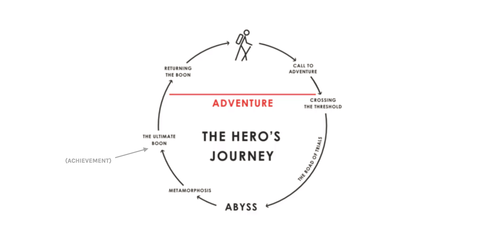
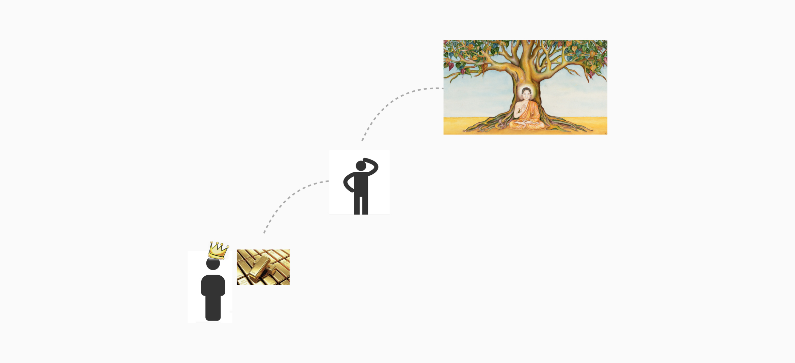
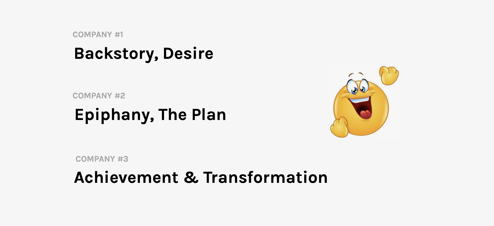

From speaking to over 300 Product Managers & Product Owners in the last 2 years, I can confidently say:

They are terrible at selling ourselves.

Terrible.

Even on simple questions about career goals, or what motivates them, a jumbled answer tends to come out that has clearly not been thought through.

Back in the days when I hired product people, worryingly, the same was true.

Jumbled answers.

Stuttered responses.

Sentences with no clear point to be made.

And it struck me one day:

Why do so many PMs & POs go into interviews blind?

As if they have no idea what might come up?

Or simply unprepared for the questions when they do come?

I realised the problem:

That almost every product person I’ve spoken to goes into an interview with the following assumption:

That the interview is controlled by the interviewer.

That they are _inevitably_ the dominant person in the conversation. The one who controls the conversation. The Alpha, if you will.

Yet this assumption is simply not true.

In the following article, I will demonstrate:

1. Why - & how - we can control an interview
2. Share my own experiences & those of countless PMs I have worked with to show you it works
3. Share a simple framework for dramatically increasing your interview success rate - & commanding a pay rise in the process

## The Second Dimension of Power
We tend to think of power or control as something quite straight forward:

Person A is stronger than Person B, so Person A has power over person B.

This is what we call the “first dimension of power". The simple, basic version of power.

Yet there is another dimension that is a far more powerful tool for us to use in the context of interviewing for a new role:

The second dimension:

Agenda-setting.

The ability to set the agenda about what is going to be talked about.

Essentially, limiting the options to two or three topics that you know will play to your strengths. That allow you to control the conversation without the other person even realising.

Now, we understand this concept intuitively. And you can probably think of a few friends or colleagues that are adept at wielding this tool!

But it is rarely used.

You might think it sneaky, or as something a little insidious. Yet it is something that we use subconsciously every single day.

When we present two options for dinner to our partner - knowing we would be happy going to either - we are agenda-setting.

When we run a workshop & choose a problem to focus on - & choose to present that problem in a certain way - we are agenda-setting.

When we are trying to be healthy at the supermarket & our inner-self tells us we can only have a chocolate bar OR a small cake (both still unhealthy options), we are agenda-setting.

So, agenda-setting is simply a reality of our day-to-day lives. A tool there for us to use to become more influential with those we interact with.

Specifically, in the context of the interview, we want to make sure we control the agenda from the earliest possible opportunity.

Usually, that means from the first question they ask us:

> “Tell me a little bit about yourself…"  

(Or some variation of the above).

If we know this question is going to come up first, we want to create a hook - something that really piques their curiosity - to act as bait, so that they can’t resist asking a follow-up question.

So, all we need to do to take control of the interview?

Prepare our script for that first question with the right hooks to draw them in.

And that script - one you can put into practice today - is what we’ll cover next.

## The Hero’s Interview Script

Ultimately, within every film, every book, every religion, every myth, we see something called “The Hero’s Journey".

The hero’s journey tends to be present in almost every single story that is told - at least every one you actually remember.

Think Frodo in Lord of the Rings.

Harry in Harry Potter.

Or Odysseus in Greek mythology.

The structure is always as follows:

1. We have a person who is called to adventure - usually against their will
2. They then cross the threshold into some sort of adventure
3. They come across a road of trials
4. They run into an abyss - everything seems like it's going wrong on it
5. Then, usually 20 minutes before the end - in the case of films - there is some sort of transformation and realisation.
6. At the end, we then see the character overcome whatever challenge they faced - achieve some sort of difficult objective - whilst coming out the other side a transformed, improved, more enlightened person.

And we see this in EVERY film book myth ever, in almost exactly the same format.

An example:

It may not like it, but this is my professionally illustrated story of the Gautama Buddha…

Broadly, we have these stages:

1. Gautama - also known as Siddhartha - started as a Prince, surrounded by wealth, power, status, etc.
2. He was then **called to adventure**, by a nagging sense that life was not just about wealth and power. He felt he was lacking purpose and that his current situation was not the right path for him
3. With that realisation, he decided to **cross the threshold** into the realm of adventure, going on **a difficult journey** to five different sort of gurus at the time to try to understand - you know - what is the meaning of life?
4. Finally, **after these trials and unanswered questions**, feeling dissatisfied with all their answers, he then looked within
5. **He finally realised** that, only by himself - by sitting under a tree in silent contemplation - was he able to, after a period of silence, come through the experience enlightened with a better understanding of what life is really about. What pain is, how to ultimately live a good life and how to use that understanding to then teach others as the Buddha

And we see that final stage - the metamorphosis and transformation - Siddhartha into the Buddha - not looking for purpose for himself, but to help others find inner peace and happiness.

### Why This Matters

So…

Why is this all relevant to how you pitch yourself?!

It is an unfortunate truth - but a truth nonetheless - that, when it comes to meeting other people, they don’t care what you do.

They don’t care how hard you might have worked at something.

The obstacles you know you’ve overcome to get where you are.

They care why you did it and they care about the story they piece together in their mind about you.

They don't care that you are, for example, “a product manager".

That leads to a boring story they will tell themselves about you.

Instead,

> **People need to empathise and be part of your journey to care.**   

## The Boring Interview

Take the example of interviewing:

Typically, when we are interviewing for a new job, it usually goes like this:

The interviewer: “Tell me a little bit about yourself?"

You: “Well, I was a Product Owner for 2 years at this company where I managed our development sprints.

I then went to another company where I was a junior Product Manager and managed sprints, as well as some customer research.

I then joined another company, working with a team of 5 people on this - and that - and bla bla bla bla."

**You find it boring. They find it boring. And everybody knows all this stuff anyway, as it’s sitting on your CV in neat little summaries, or they’ve seen it listed on your LinkedIn.**

It’s a complete waste of time. And you lose their interest extremely quickly.

Remember:

> **People don’t care about what you do. Not really. Instead, they care about your journey. Your motivation. Your _story_.**   

About how you get here.

Yet many people fail to understand this and make a bad first impression in critical, life-changing situations like these.

Luckily, this is an advantage for you, because if you can learn to actually leverage this model in practice, I guarantee you will improve:

1. Your career prospects
2. Your ability to make a better impression with people
3. To get buy-in more effectively from those you work with with just a few minutes of work on your story.
4. How you pitch, yourself, your business, your product vision. Anything

And get people to _want to_ help you. To _want to_ buy into your journey.

## The Compelling Interview

Instead, let’s imagine that boring interview a little differently. Let’s tell a compelling, continuous story that is engaging and interesting.

Talk about the struggles you faced in your first company - even the struggles you faced growing up, getting your first job, getting to this interview.  

About being new to product. Overcoming the _obstacles_ of a pushy boss who didn't understand product, talk about your _desire_ to improve yourself and to become the best product owner possible.

Then, when it comes to talking about your 2nd role, frame the transition as an epiphany.

Talk about the moment you realised you needed to leave your first company to grow & your plan for making that happen.

Talk about how you stepped into a more senior role, where you started learning things outside of the role, proactively reading and going to workshops, quickly being given more responsibilities.

Then, to demonstrate what you achieved, talk about the promotion you received to become a Senior Product Manager, where you helped transform the organisation to be more product-led, data-driven, etc.

Then, you can talk about the transformation you went through along your journey, from lacking confidence, feeling like an imposter to this confident product leader you are now.

And then, finally, how this transformation has led you to this job - and this interview - because the role you are applying for is the perfect fit for your skill set, your purpose and would be the perfect experience to help you further along in your journey of transformation and achievement,.

And instead of the interviewer just writing a few notes and day dreaming about what they are having for dinner this evening, you have them:

> “Wow. This is fascinating. This person has really had an amazing journey. I like just being around them. And I’m rooting for them. I want to help them get to the next step in their journey!"  

## The Boring v. Compelling Interview Script

Ultimately, with these two interview scripts, we are talking about the same thing!

The same job, the same responsibilities, challenges faced, achievements.

We are still following a chronological pattern, covering the same topics, for example.

The point of crafting our Hero’s Journey, however, is that the emphasis is very different. We are emphasising very specific highlights within our Hero’s Journey:

Repackaging that into a simple script, touching upon the following:

1. **The back story:** Where did it all start? What struggles did we face? E.g. growing up, finding a job, getting good at that job
2. **Desire** - what was the challenge we were faced with and wanted to solve?  
3. **Epiphany** - What - and when - was that moment of realisation when we decided enough was enough?
4. And, then, what was **the plan** we decided upon to change our current situation and start moving towards our desired outcome?
5. Once we had a plan, how did we put into **action**? And what were the results? How did we overcome obstacles along the way? Any specific examples?
6. And finally, what **transformation** did we experience? How did we come out of the experience better, happier, stronger, having a great impact on others ,etc., in the process?

We don’t need to talk about quitting our 9-to-5 to make millions working from a beach in Bali. Or about changing the world in any big way to write a compelling story.

We just need to build empathy and create a more deliberate, thought-out journey for ourselves - rather than sounding like we just followed wherever a job offer appeared and vacillated all over the place.

It should feel like everything was part of the plan. One step forward towards your desired future.

And we are inviting the interlocutor - the listener - in to join us along that journey.

And we do so because it makes our narrative far more compelling, far more likely to trigger empathy, far more likely to get the listener on your side.

## An Example Of The Interview Script

Here is the genuine Hero’s Journey script that I used to use to open an interview:

_When on a solo trip in the Brazilian Amazon back in 2012, I decided to start my first business, BackTracker._

_2 months later, when I got back to the UK to really start building that business, I realised I had absolutely no idea what I was doing._

_We made every mistake possible, driven by ego, instinct, a complete lack of product strategy or process._

_After 2 years - and a lot of failures along the way - that business failed._

_In the aftermath, feeling a lack of purpose & trying to work out what had gone wrong, I remember asking myself:_

_What makes some products succeed, and others fail?_

_Over the last 8 years, I’ve been obsessed with trying to answer that question, working as a product consultant and founder to understand - and experiment with - the factors needed for product success._

_That journey has led me across 3 continents & to work with countless companies in the search for answers, culminating in the publication of my first book in 2019, Why Your Startup is Failing._

_Along my journey, I realised product success depended on a lot of things, but that it wasn’t about rapid scale or fame or building the next big thing, as I’d thought it was back in 2012…_

_But, rather - at its core - about creating value._

_Now, I’m looking to apply my learnings in an environment like your company to create impact for [insert customer type, the problem the company is trying to solve & the business]._

1-2 minutes in total.

Concise. Leaving a few hooks to draw the interviewer in, rather than trying to cover everything in detail.

What do you think the follow-up questions tend to be?

1. _“Wow, you wrote a book. How did you do that?"_
2. _“Tell me about some of the successes and failures of your first business?"_
3. _“You mentioned creating value being really important. How do you do that?"_

And - surprise, surprise - I had answers prepared for these 3 questions before every single interview.

Because of practicing my delivery, learning the script & constantly using the script, I got an offer for around 80% of the roles that I interviewed for by using this.

Because I was prepared.

And because I controlled the interview, not the other way round.

## Leveraging The Hero’s Interview Script

If you look at the nuts and bolts, it’s nothing special. Ran a few businesses, worked for a few others in product. Wrote a book. But it makes you want to buy into the journey, right? Or at least to empathise more with my story?

**Whatever you may think about your life, you all have a truly compelling story to tell.**

It just needs to be uncovered.

And packaged correctly.

In the Prod MBA, we’ve taught students to leverage this to get their ideal job:

1. **From Tom, who got a 30% salary increase, a new role & now leads strategic decisions at his company ([read his full story here](https://prod.mba/story/tom))**
2. **Or Elaine, who successfully moved from Product Owner to a Senior Growth Product Manager role within 2 months of working with us ([read her full story here](https://prod.mba/story/elaine))**

---

**So, you now have a few options in front of you (see how I’m agenda setting there?!):**

1. Have read this article, forget about it & find yourself completely unprepared the next time you find yourself in an interview
2. Write down an answer for each bullet point of the Hero’s Interview Script & keep it in your notes somewhere to practice before your next interview
3. Get in touch with me **[here](https://www.linkedin.com/in/henrylatham/)** to see how we might be able to help accelerate your product career
