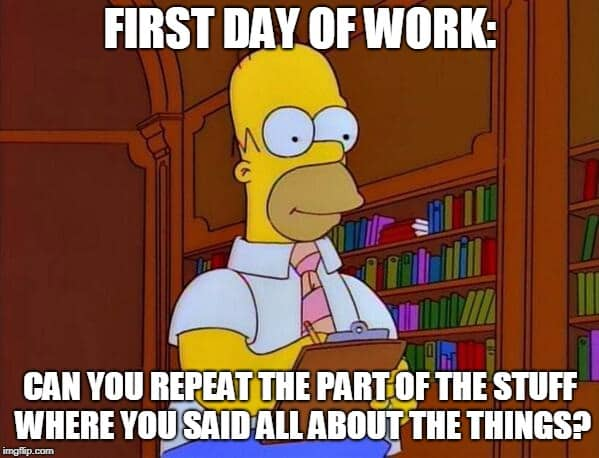

I see a lot of stupid product career advice online.

Webinars on “how to deal with a toxic work environment”.

Or “10 tips for managing difficult stakeholders”.

Advice which hooks us in, because it promises a solution to a frustration we face:

Usually, handling leadership & a work culture that does not value being product-led.

Unfortunately, however, the reality is that most of this advice is completely ineffective.

Pointless.

A waste of time even engaging with.

Why?

Quite simply, because it’s trying to alleviate a symptom of the problem, not the root cause.

And, if you aspire to become a true leader - an effective product leader - then you need to be in the business of solving root causes, not symptoms.

Yes, you could pick up a few tactics on dealing with the pressing despair & frustration of working in an environment that doesn’t value good product work.

A place where phrases like “what’s the point of speaking to customers?” Or “ we know what our customers want” may be common place.

You might learn how to stay _a little bit_ more calm.

To despair _a little bit_ less.

But it’s not going to solve the problem.

### The Reality For Most Frustrated PMs

The reality is this:

That, if you find yourself in a toxic environment, there is very little you can do to change that.

Certainly not as a lowly PM.

Still unlikely even if you find yourself as CPO or Head of Product.

There are just too many other players, too many other incentives, too many other sub-cultures for you to tackle.

So, rather than reading a silly article on “how to handle a toxic boss”…

Or _hoping_ that somehow things will magically change for the better…

You’d be better ignoring that advice.

You’d be better recognising that nothing will change that toxic culture.

And, instead, spend your time plotting your path out of that toxic culture to somewhere you can truly grow.

### The Cost of Not Acting

When I first moved to Berlin, 4-5 years ago now, I joined a startup.

Week 1, all new and exciting. Shiny new laptop, cool equipment, nice office. The works.

By the end of the first month, I realised our boss was a narcissist, there was no attempt to be product-led & the whole value proposition made no sense.

As the months past, I became less engaged. I stopped caring. I started heading home at 4.30pm. Didn’t turn up to “team events”.

And, one morning, opened my email to see a short, curt note.

I had been fired.

Why?

Well, fair enough, I thought. It’s not like I had been adding any value over the last 2-3 months!

After the shock - and the hit to my ego - I realised I had learnt a valuable lesson, however:

That, moving forward, I had to align any new opportunity with a culture I believed in, a vision I bought into it, and, perhaps most importantly, that the opportunity was a clear stepping stone to helping me achieve my _personal_ vision.

If I didn’t, I know I would become listless & disengaged.

That would lead to poor quality work.

Lack of motivation to learn new things or push myself.

Another firing further down the line, even.

## Person-Product Fit

But, enough about me.

Let’s get to the root cause, so you can act swiftly & decisively to change your current situation.

Don’t listen to advice on “better managing difficult stakeholders” or “adapting to a toxic work culture”.

It’s a waste of time.

Instead, focus on how to plot your path out.

On how to align your personal vision with the right product in the right company.

The one that will help you grow. 

You can do that through coaching.

You can do that through introspection - mindfulness, journaling, even daily walks.

My advice?

Keep it simple.

Write down your answers to the following:

1. **What do I want?**
2. **What would I need to do to get there?**
3. **Am I willing to put the work in to get there?**

### What do I want?

Think about the specific kind of role, what doors that might open, the kind of company culture & size you think might be a good fit for you.

### What would I need to do to get there?

Don’t just expect a great role to magically present itself to you.

You need to understand where your skills gaps are, how to pitch yourself effectively, how to build a strong product case study & playbook to present on your CV & when interviewing.

### Am I willing to put the work in to get there?

Perhaps the least acknowledged topic in the space of career development:

The work.

Getting a great product role is not easy, particularly if you are coming from a low-impact, toxic environment with little success to show for.

In most cases, to get a great product role at a good company, you will need to put work in.

That means building a personal brand through daily or weekly content.

That means working on new skills on the side, such as programming or UX/UI.

That means building a real product as a side project so you have a real process with real results to point to.

Unfortunately, due to a lot of bad advice out there & our infinite ability to _hope_ things will magically improve, we rarely acknowledge the need to not only be clear on what we want out of our careers, but also the specific steps we need to take to get there & the work & persistence to ensure we do, in fact, get there in reality.

But there’s no avoiding it.

So, you can either carry on reading articles promising the world, and attending webinars that might make you feel there is a way out.

Or get started today by answering these 3 questions, and plotting a concrete way out of whatever underwhelming, unpromising role you find yourself in at the moment:

1. **What do I want?**
2. **What would I need to do to get there?**
3. **Am I willing to put the work in to get there?**
