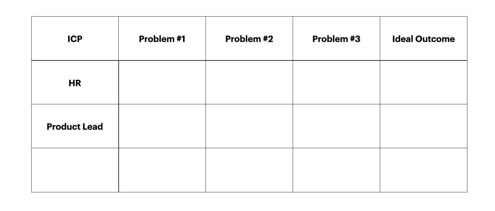
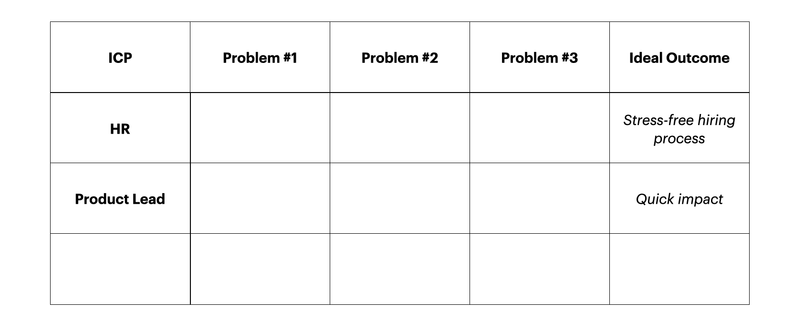
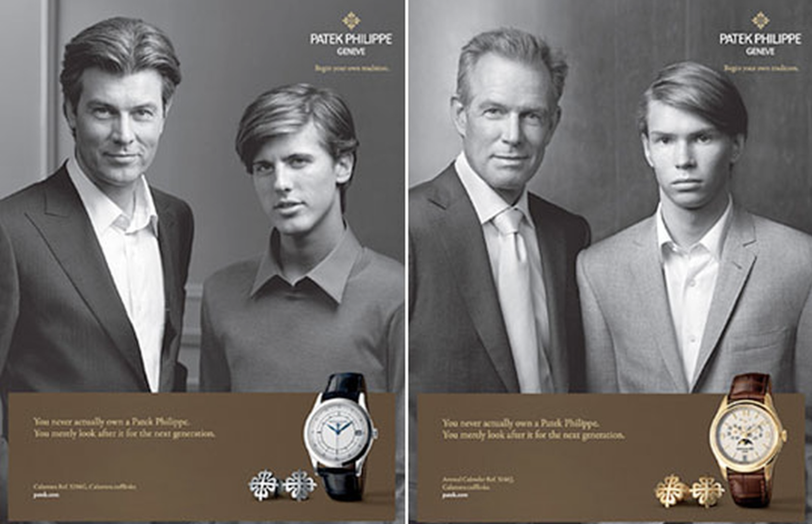
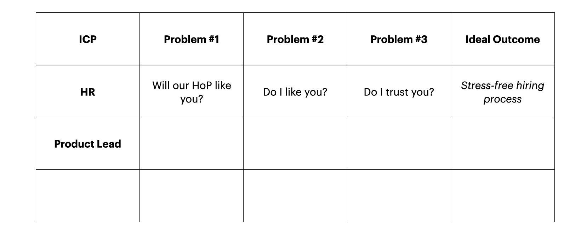
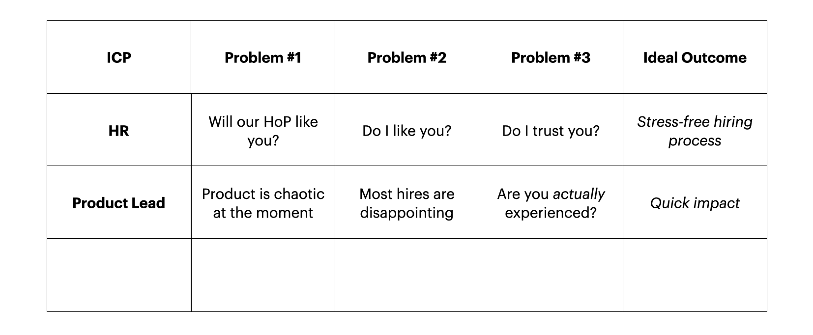
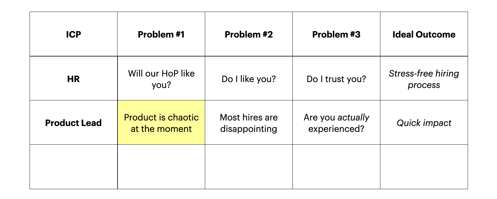
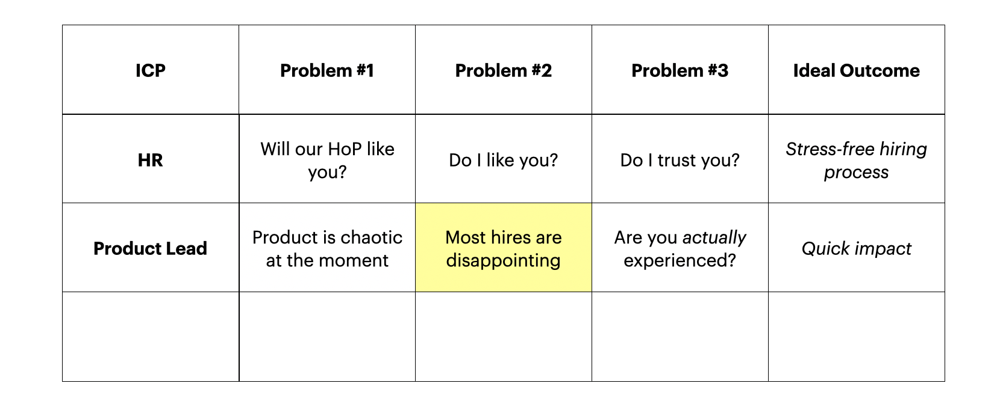
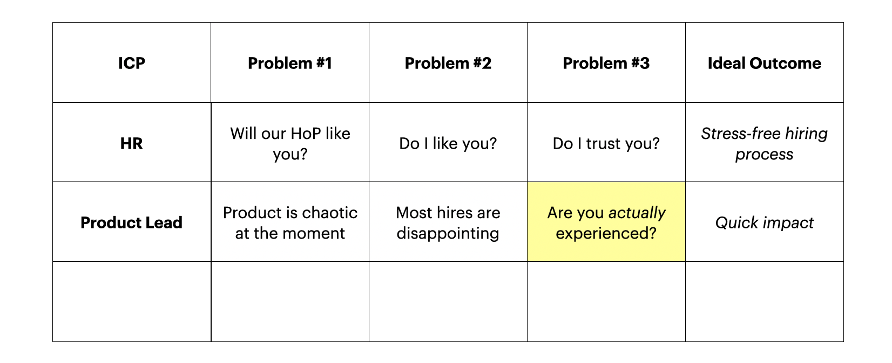
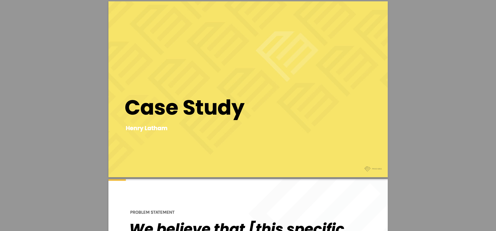

**In product, we would all agree that it’s best to work in a customer-centric & strategic way.**

**Yet, when it comes to our *careers*, we throw this all out the window.**

And, as a result, miss out on life-changing career opportunities.

Why, when working on ourselves, do we not apply a similar product-led process?

Why do we leave these huge, life-changing opportunities - finding the dream job in many cases - entirely up to chance?

And how can we approach the product interview & job opportunities radically differently?

---

In the following article, I will outline why we need to be customer-centric, strategic & proactive in how we approach the product interview.

Specifically, how we talk about our product experience & process in a way that is compelling for the person interviewing you.

I will then go on to outline 3 specific, proven tactics that we have successfully applied with many clients to massively increase your interview success rate and - most importantly - help you land your dream job in the process.

[Antonia](https://prod.mba/story/antonia), [Elaine](https://prod.mba/story/elaine) & [Tom](https://prod.mba/story/tom) all show that this process really does work.

In this article, Part 1, we will cover that first tactic in detail. In [Part 2](https://blog.prod.mba/2021-08-19-pt-2-successfully-apply-for-5-year-roles/), we'll then cover the other tactics.

But first…

## Why Does Being Customer-Centric & Strategic Matter?

When we work on a product, you likely intuitively understand the value of being customer-centric:

By understanding who our customer really is & what their key frustrations are, you can start to understand what they really want to achieve (their desired outcome).

You can also start to understand how you might help them achieve that desired outcome with a solution.

Furthermore, when you work on a product, being strategic is a huge advantage.

To not just come into the office one day and say “let’s build this cool solution I came up with in the shower”.

To, instead, think through who the customer is, what they really want & how we might best deliver value to them in the real-world.

In doing so, addressing the 3 core tenets of product management, in order of importance:

* Value risk i.e. will they really want this?
* Feasibility risk i.e. can we actually deliver this?
* Usability risk i.e. can they actually use it & get value from this?

My point?

Don’t simply rush into building the first idea one of your team comes up with.

Be strategic, not reactive.

And by focusing on your customer - whilst making decisions strategically in how we deliver value to them - we invariably have more success with our products (see Startup Genome Report 2020, _Why Startups Fail_ by Tom Eisenmann, Marty Cagan, Steve Blank, et al.).

Why?

Because we are more likely to actually understand what they want and, therefore, to deliver the right solution for them:

A solution they _actually_ use (ideally on a regular basis), that they _actually_ tell their friends about and that they are _actually_ willing to pay for.

## Why Most of Us Fail Interviews
Unfortunately, when it comes to interviewing, most of us forget these transferrable principles.

We go in to an interview with very little understanding of who will be interviewing us & what they ultimately want (i.e. NOT customer-centric).

And we go in thoroughly unprepared for the same questions that invariably come up in product interviews (i.e. NOT strategic).

In short, we go into an interview like a rabbit in the headlights:

Letting the interviewer take control of the situation, with us simply playing defence & hoping for the best!

Which - if I didn’t make this clear at the start of this article - is CRAZY when getting (or not getting) that job will change the course of your entire life!

We want to be customer-centric & strategic, not ignorant of our customer & reactive.

We want to proactively approach each interview as we would our product work, treating ourselves as a product and applying a product process to:

1. Understand who the person/s interviewing us is (the customer) & what they ultimately want - and no, it’s not just “a Product Manager”
2. Prepare for the interview to address any concerns they may have about us not delivering what they ultimately want

 

# Understanding Your ICP
Whether we call this a user persona or ICP or target customer or whatever the term, the essential first step is to truly understand who our customer is.

_“Well, they just want to hire a Product Manager, right?”_

You may think.

But you would be wrong.

What do they _truly_ want?

In order to understand this, we need to dig a little deeper.

That’s where the ICP comes in, a concept taken from sales:

**The Ideal Customer Profile.**

An ICP is essentially,

> “The customer persona you expect to become your most valuable customer” — Tom Scearce, Gartner  

Really, in our context, the interviewer who will find our personal story most compelling.

But why do we want to think of the person interviewing us as a customer?

Because, firstly, because it adds some gravity to how we think about the “interviewer”. It helps us switch mindset to be more proactive, rather than reactive, in how we approach finding our dream role.

Secondly, we are ultimately a product. A product that needs positioning & that needs selling. Therefore, we should sell ourselves as any sales team would sell a product: With their ICP always in mind.

In order to understand our ICP, we need to do 3 simple things:
1. Define who they are broadly
2. Define the ideal outcome they are looking for
3. Define 3 specific, core problems they face in relation to hiring

Even completing this simple exercise - and applying this first tactic - will increase your interview success rate dramatically.

And it only takes 5 minutes to complete.

 

### Step 1: Define Your ICP

Now, in the context of successfully applying - and interviewing - for your dream role, you are generally looking at two Ideal Customer Personas:

1. The HR person who posts the job listing & conducts the first interview
2. The Product Lead: Maybe the Head of Product or Senior PM - really, whoever would be your senior & is looking to hire you into their team

So you would add “HR” and “Product Lead” to the table above to start.

 

### Step 2: Define Ideal Outcome

Next, you want to understand what they really want:

What their ideal outcome is.

To do so, you need to differentiate between what they do (the external problem) and what motivates them to do it (the internal problem).

Understanding this difference between an internal and external problem is fundamental not only to interviewing well, but to building great products, as misidentifying the root cause of a problem is the biggest reason start-ups - and products - fail (CB Insights, Eisenmann (2021), Kohavi et al (2020)).

As an example, people don’t buy an expensive Patek Philippe watch to simply tell the time (the external problem).

They buy it to give them a sense of social status & to feel they will leave a legacy for their children, by passing the watch on to them (the internal problem).

 

If you positioned a £2,000 watch as just something that “can tell the time”, nobody would buy it, because that’s not what they are really buying it for.

Applying this logic to your hiring team ICPs, both the HR Manager & Product Lead may be looking to “hire a Product Manager” (the external problem), but the motivation actually driving their actions is quite different:

1. For HR, it may simply be “a stress-free hiring process”, as they aren’t incentivised to really understand or relate to what the PM does when they start the new role
2. For the Product Lead, they may ultimately be looking for somebody to simply to make a quick impact (thus taking the pressure off themselves & alleviate their own stress)

This is key.

Why?

Because once you understand what really motivates them, it changes entirely how you position & sell yourself to each ICP.

 

### Step 3: Define Core ICP Problems

Finally, you need to understand the specific problems that they are facing in order to go on the attack & to address them directly when you prepare for each interview.

**For HR, the key problems are relatively straight-forward:**
1. “Will _the Product Lead_ like you?”
2. “Do _I_ like you?”
3. “Do I _trust_ you?”

*(I talk about how we address these HR fears/frustrations with the highly-effective Heros’ Journey Interview script elsewhere, in [this article](https://blog.prod.mba/2021-07-16-how-to-increase-salary-by-30-percent/)).*

 

**For the Product Lead, the key problems are slightly more complex to answer (& far more complex to solve!):**
1. “Product is chaos at the moment.. How we can we bring more order?”
2. “Most hires are disappointing. Why would you be different?”
3. “Are you _actually_ experienced enough to do well?”

To break down what the consequences of these problems are - and how we can leverage our understanding of these to dramatically improve our interview success rate - let’s explore these in more detail:

 

#### “Product is chaos at the moment.. How we can we bring more order?”

Not all product teams are chaotic, but they do all operate in conditions of uncertainty - conditions of _“extreme uncertainty”_, in the words of The Lean Startup’s Eric Ries, in a startup.

It’s simply an inherent reality of doing product work, as we can never predict outcomes & there are so many moving pieces.

As a result, if somebody is hiring, it means they are either hiring you to bring more order to their product process or, in a company that is happy with its process, it’s to bring order to - and take advantage of - a new or existing opportunity that they would like to address.

That means, when it comes to the interview, rather than simply listing previous roles you did & a few outcomes you might have achieved, you want to clearly and succinctly demonstrate what your product process is & how you have brought order to other products - and delivered value - before.

By doing so, the Product Lead will make the assumption that you will be able to take that process & effectively apply it in their company to help bring order to the chaos they are currently living.

 

#### “Most hires are disappointing. Why would you be different?”

If you actually stop to objectively analyse the teams you’ve worked in, you will probably see a trend:

That a small minority deliver a majority of the value.

And that a large majority deliver only a tiny bit of value.

Good Product Leads will be very much aware of this reality, as they would have hired many times before.

And, even with experience and a good hiring process, would have been disappointed many times before by new hires.

Whether that was their fault or the fault of the new hire is irrelevant.

The point is this:

**If you understand that their big fear is for you to come in & fail them, then you massively increase your chances of gaining trust - & getting the role - by demonstrating that you have a process & experience coming into new roles & delivering impact from Week 1.**

As when you demonstrate you have an effective product process, it is music to their ears!

 

#### “Are you actually experienced enough to do well?”

Finally, linked to the previous fear, the Product Lead will be very aware of another fact:

**That many people talk the talk.**

**But few actually walk the walk.**

This is why many companies add a requirement for 3 or 5 or 10 years’ experience.

Because it _implies_ experience.

It _implies_ that, if you’ve been in the game for a long time, you must have had enough learnings to actually be good at product!

And this is a realisation that you can leverage to your advantage.

How?

By getting them to buy into you.

To trust you.

To realise that, despite your few years of experience, you have a tried & tested process for building great products & managing effective product teams.

Rather than simply listing previous roles from your CV 😴, you need to get into the specific details about what is important in your process & how you have delivered results before 🤩.

_(If you don’t even know where to start - or lack enough experience - not to fear. We will cover how to position yourself effectively in the second article in this series.)_

Specifically, when talking about your previous experience working on product, you want to make sure you cover the following topics, in the following order, to demonstrate process:

* **Problem:** What is the backstory of the product? Why does it exist?

* **Vision:** How did you leverage your early research to form a customer-centric vision?

* **Product Strategy:** What specific gap in the market did you go after? Why? And how did you then take strategic steps to deliver value? What were the main stages of this process?

* **OKRs:** Can you organise these stages into clear objectives & key results you aimed to (and hopefully did) achieve?

* **Customer-Centricity:** How did you leverage customer feedback to inform the vision, product strategy, roadmap & individual features? Can you give examples?

* **Data:** How did you leverage analytics data? Qualitative data from customer conversations? Sales or customer support feedback?

* **Leadership:** How can you craft all of these points into a _compelling story_ about your customer, their desired outcome & how you delivered value to them incrementally? (This helps you implicitly demonstrate your ability to influence stakeholders & motivate a team)

 

In Part 2 of this series, we’ll deep dive into each of these points - sharing the Prod MBA Case Study Template for the first time - to help you craft your own compelling process, so you can nail that next product interview.

For now though, you can get started by writing out 2-3 bullet points per question.

## Don’t Be Held Back By Years of Experience

I’ve worked with over 150 PMs & POs at this point as part of running [Prod MBA](https://prod.mba/).

I can promise you that, if you work hard to put a strong product process together, you will get your dream role.

**[Antonia](https://prod.mba/story/antonia) would be testament to that. As would [Elaine](https://prod.mba/story/elaine). As would [Tom](https://prod.mba/story/tom).**

Because I’ve also seen PMs with 10 years’ experience have no idea what they are doing.

Heads of Product that have no idea what they are doing.

They may have years of experience - and experience managing teams and/or development tasks - but they most definitely do not have a process.

And that lack of process comes across very clearly in an interview.

Do they make the Product Lead think this?

_“This person is going to bring order to chaos. They are different & I’m excited about working with them. They’ve clearly got the real-world experience & process to back that up”._

No, they don’t.

And that’s why, if you come in prepared.

If you come in proactive.

Strategic.

Customer-centric.

You can successfully apply for any role requiring far more years of experience than you may have.

**Want to get started building your product playbook?**

**There are three things you can do:**

👉 Read [Part 2](https://blog.prod.mba/2021-08-19-pt-2-successfully-apply-for-5-year-roles/)

👉 Get started with our free 7-Day Mini MBA [here](https://bit.ly/3xKY9mB)

👉 [Book a free Career Strategy Session](https://bit.ly/3yWwWyV) so we can work on your playbook together - these are very limited, so book ASAP!
