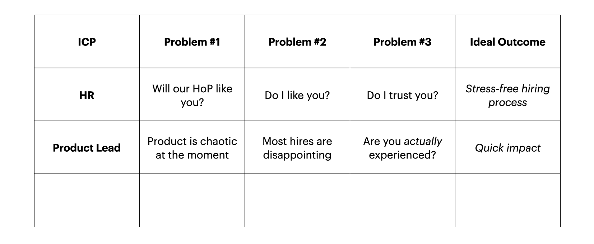
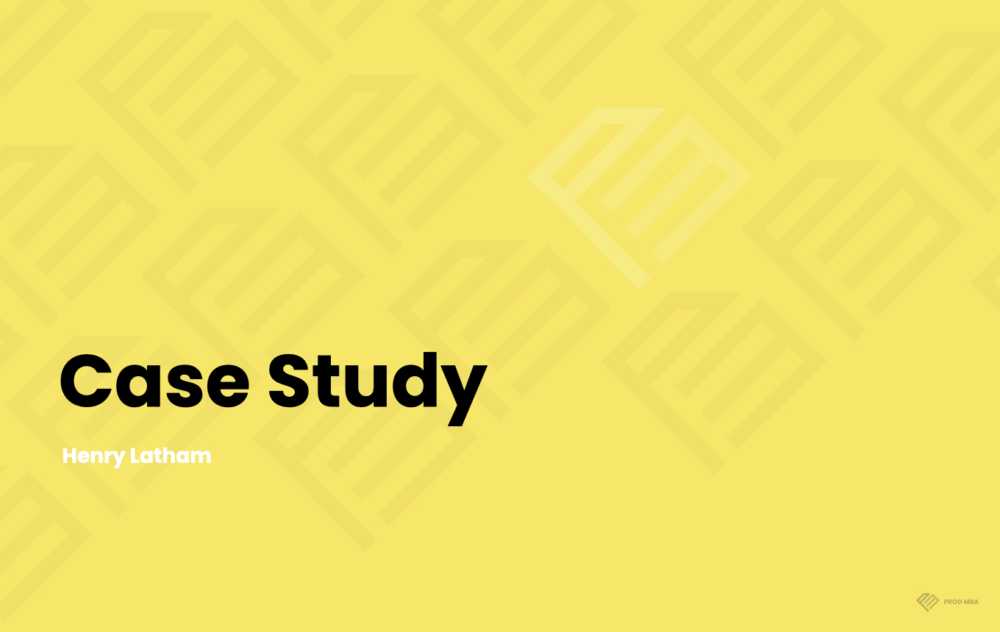
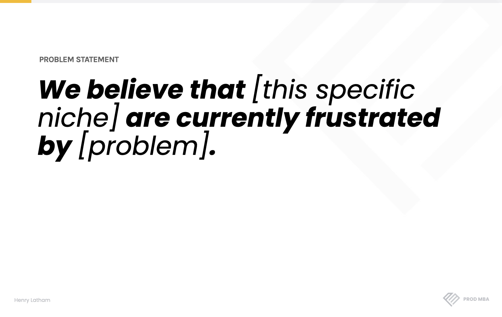
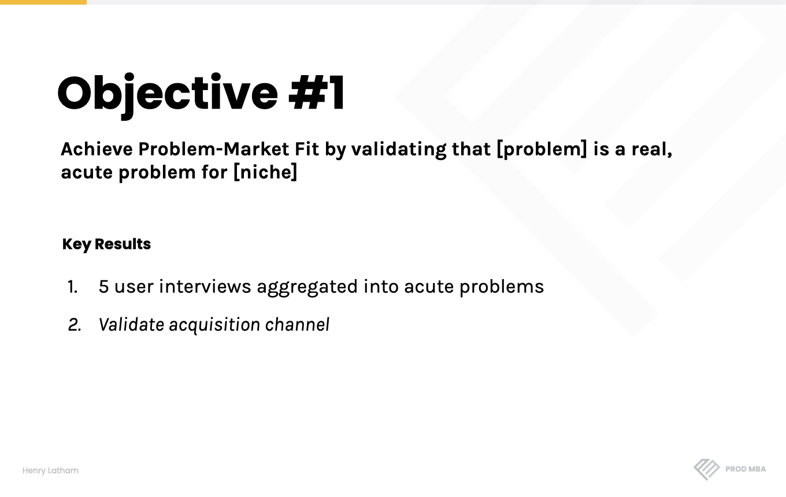
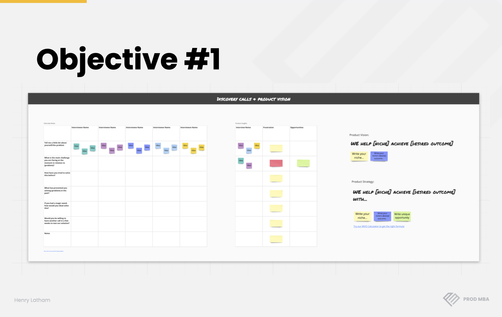
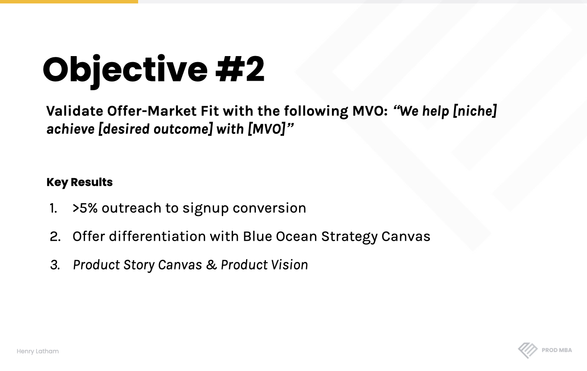
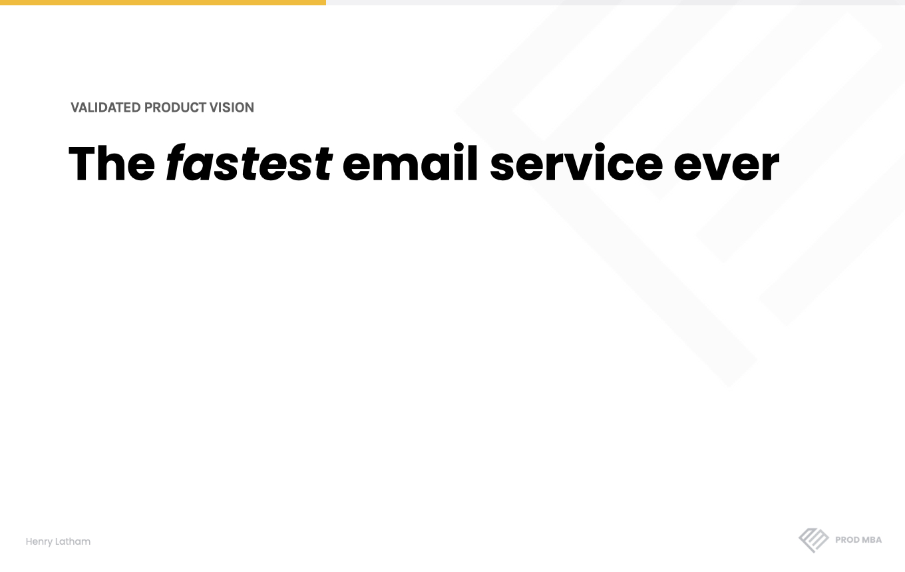

*This is Part 2/2 of our series on dramatically improving your interview success rate. You can skip [Part 1](https://blog.prod.mba/2021-08-12-successfully-apply-for-5-year-roles/), but I’d recommend catching up on that first to understand WHY we apply the following interview tactics.*

As covered in [Part 1 of this series](https://blog.prod.mba/2021-08-12-successfully-apply-for-5-year-roles/), Product Managers are terrible at selling themselves. Terrible at interviewing. Terrible at even preparing for interviews.

Despite being customer-centric & strategic in how you approach product - at least in theory! - when it comes to you careers, you act like complete amateurs:

Unprepared & reactive, despite the massive implications - the _genuinely life-changing gravity_ - of getting your dream job or not.

[In the first article of this series](https://blog.prod.mba/2021-08-12-successfully-apply-for-5-year-roles/), I outlined why you need to be customer-centric, strategic and proactive in how you approach career development.

I then outlined one super simple, very actionable tactic you can put into practice to at least _double_ your interview success rate.

In this article, Part 2/2, I will cover two further tactics that will make you the dream candidate in the eyes of any hiring team:

Helping you land your dream job in the process.

## Treat A Hiring Team Like A Customer
In Part 1, we outlined who we are dealing with in each hiring process, what they want and the key frustrations they feel - frustrations that, if we understand, we can leverage to our own advantage.

We highlighted two key decision-makers in the process:

[In a previous article](https://blog.prod.mba/2021-07-16-how-to-increase-salary-by-30-percent/), I have outlined how we can pitch ourselves so effectively to HR or a recruiter so that you are almost guaranteed to get to the next round of an interview (using something called the [“Hero’s Journey Interview Script”](https://blog.prod.mba/2021-07-16-how-to-increase-salary-by-30-percent/), which we have successfully taught to over 100 [Prod MBA](https://prod.mba/) graduates).

In _this_ article, I will teach you how to do the same when confronted with the Product Lead - really, whichever senior product person will be interviewing you.

Specifically, I will teach you how to demonstrate that you are the perfect candidate to them when the inevitable question comes:

_“Tell me about your product process?”_

## How To Master The Product Interview
As a student finishes the 8 weeks of our bootcamp, they prepare a Case Study outlining their entire process, from the problem they started with, to the customer-validated vision, product strategy, OKRs, how they delivered on those OKRs, their principles & their process.

Why do we do this?

Because it is the perfect tool to:

1. Create - and actually _experience_ applying - a strong playbook that they can take into in any product role, whether on a new or existing product in their current company, or in future when they move company
2. Pitch themselves _really_ effectively to hiring teams

But, focusing on the second point today, why is it so powerful when it comes to helping PMs pitch themselves?

Because it directly addresses the 3 key fears & frustrations of every Product Lead who is hiring:

1. **_“Product is chaos at the moment.. How we can we bring more order?”_:** The Case Study demonstrates that you have a robust, but flexible, product process that can be applied to the product you will be working on in the new role
2. **_“Most hires are disappointing. Why would you be different?”:_** The Case Study implies you are one of the rare candidates who can immediately create an impact by understanding the problem, strategic context, etc., as part of the points covered in your Case Study
3. **_“Are you actually experienced enough to do well?”:_** The Case Study sends the message that product isn’t just this messy thing that you have learnt as you go, but that you deeply understand the key components of a product & how, therefore, product should be built. It shows real experience, not a surface-level, random assortment of frameworks and buzzwords

## Prepare A Compelling Case Study
Stop what you are doing right now.

Block out 30mins.

Turn Slack off.

Hide your phone.

Go to the toilet.

I know for a fact that most readers will ignore this advice & will carry on with their day.

**But for those serious about fast-tracking their product career, I promise you that this will be the best use of 30mins of your time in your whole career.**

30mins can - and does - mean the difference between getting that dream product role or not.

Between remaining stagnant in your product career &, instead, developing yourself rapidly in a great, fast-growing company.

So cut the distractions & focus on the next section…

 

#### Case Study: Overview

To build a compelling Case Study, I would like you to pick one product you have worked on previously on (or even a side project that you have developed).

You are then going to need to cover the following:

* **Problem**
* **Vision**
* **Product Strategy**
* **OKRs**
* **Customer-Centricity**
* **Data**
* **Leadership**

Now, you may say, “Well, we never applied OKRs” or “What the hell are OKRs?!”. That’s fine. I am going to break these down into simple terms in the next section, as well as demonstrate how we can re-craft the product process to fit these frameworks.

 

#### Case Study: Problem

It doesn’t matter whether your product is very new or has existed for years, you still need to demonstrate in very clear, concise terms:

Who is your specific target customer? What is their core frustration? And, therefore, why does your product exist?

I’m going to use a real example from a product one of our [Prod MBA](https://prod.mba/) students, Dan, developed to illustrate how to script your Case Study:

_“Our company works in the real estate market. Through a few conversations with customers, we started to notice that first-time buyers seemed to be really frustrated with the buying process._

_After doing a bit more research, we started with quite a broad hypothesis:_

_That first-time buyers felt lost & frustrated by the buying process.”_

 

#### Case Study: First Objective & Key Results

At this stage, rather than jumping straight into what the vision was & how you built an MVP, you need to demonstrate maturity & process:

That means structuring your points clearly & showing you value product discovery.

For example,

_“We know that the real estate market is super competitive, so even focusing in on first-time buyers wouldn’t be a good place to start._

_Therefore, we started with the objective of validating that this was, in fact, a real problem and - more importantly - to validate what specific part of the problem was most acute, therefore representing the best opportunity for us to take advantage of._

_Was it the finding of the property? Putting in an offer? Organising their mortgage? Understanding all the costs involved? Getting a mortgage in the first place?_

_We therefore set three specific key results we needed to deliver to validate we had a real, acute problem:_

_1. Conduct 10 user interviews with first-time buyers_
_2. Aggregate their feedback into 3-5 key frustrations we identified in the interviews_
_3. Also, validate our acquisition channel: How we would actually track these first-time buyers down - consistently - in order to test ideas out with this group_

I managed to track down these first-time buyers through Facebook and, after interviewing them, amongst 4-5 key frustrations, we identified the “process of putting an offer in” to be the most acute & an exciting opportunity to explore further.“

(This, if you are new to the concept, is essentially what OKRs are: A clear, high-level objective with complementary, concrete & measurable key results to help us keep score).

 

Ideally, you can then also have some slides to share to visualise this process, which makes your process even more real & compelling for the person interviewing you, but this isn’t essential. You can then highlight the key themes that emerged & the 1-2 opportunities you would like to focus in on.

In the real world, you may not have started doing this discovery work so early! That’s OK. Instead, just give one or two examples of the key problems that came up in the conversations you did have & back up your story with some trends or research you conducted (or that you can find on Google right now!).

 

#### Case Study: Second Objective & Key Results

Once you’ve talked about how you grouped common frustrations from these interviews, you then need to demonstrate that you have a process for crafting & validating a product vision & product strategy.

Again, don’t jump straight into talking about what solution you built & how you manage a team. That shows immaturity. Instead, show you can operate strategically & as a true leader.

How? Use the same OKRs framework.

This second objective should be focused on defining & validating the vision & product strategy, with key results showing your process for this.

Example:

_“Once we validated that the core frustration for first-time buyers was “the process of putting an offer in”, we wanted to make sure that we could present our own offer to them that they found genuinely compelling._

_Therefore, rather than jumping into building anything, instead, we set the objective of validating we had offer-market fit with the following vision:_

_“We help first-time buyers get a fair price on their first home”._

_Why?_

_Well, in the interviews, they kept mentioning the fact they never knew when a price was “fair” or “accurate”, so this felt more important than the final price itself (or the actual money saved)._

_We then set 2 key results to achieve:_

_1. Putting the headline on a landing page, reaching out to 100 first-time buyers and aiming to achieve a 5% conversion to sign up to our “Beta programme”_
_2. We also completed a Blue Ocean Strategy Canvas to understand whether our offer would be differentiated in the market (i.e. wasn’t being offered already)”_

Again, even if you didn’t approach your product with this exact process, simply spend time restructuring your old process to fit this OKR framework. It will more effectively demonstrate you understand how to approach product, as well as presenting a logical, clear story of your product process to the person interviewing you.

 

Any ways to visualise this, such as the one above, are always powerful in reinforcing your points (and your competencies).

 

#### Case Study: Validated Product Vision

It’s so important to pause & present the vision here. In our example, that vision was:

_“We help first-time buyers get a fair price on their first home”._

Why?

It implies you understand the importance of vision, of how to craft one, of how to be truly customer-centric from Day 1, as well as understanding what product strategy is (i.e. focusing on one specific area of value, rather than trying to do everything in a busy market).

 

#### Case Study: Building Solutions

After this point, you are likely to be far more comfortable talking about your process of finally building out a solution.

This is where you can talk about wireframing, prototyping, testing, managing a team, development, etc.

The most important thing is that you have demonstrated your ability to be strategic, to be customer-centric, to have an effective process - all by covering the first few points we cover in the Case Study,

If you really want to build a full, compelling Case Study, in Prod MBA, we suggest still using the OKR framework at this point to demonstrate:

1.  How you came up with your initial solution (in our case, we use a workshop to generate ideas & then prioritise them)
2. What your longer-term strategic roadmap looks like (to show you understand the different stages of your strategy & the limitations of time & resources in what you can actually build in practice)
3. Visual assets, such as a Customer Journey Map, to demonstrate how you can organise a team to generate ideas & structure them into a final idea of your solution effectively
4. Your process for building out a prototype, testing it & iterating on it before actually developing a custom-coded solution
5. The Product-Market Fit Engine for objectively validating whether your product has achieved product-market fit or no

 

You can get [all of the slides for building out a full Case Study here](https://www.dropbox.com/s/evoildadg64l0hf/Prod%20MBA%20Case%20Study.key?dl=0).

## Pitching A Compelling Case Study
By preparing a Case Study like the one above, you are able to directly address the main fears of the Product Lead interviewing you:

1. “Product is chaos at the moment.. How we can we bring more order?”
2. “Most hires are disappointing. Why would you be different?”
3. ‘Are you actually experienced enough to do well?”

Yet an essential part of making this tactic actually work in practice is something seemingly obvious:

Our second tactic:

Actually _pitching_ your Case Study effectively!

It amazes me how many presentations or interviews I see that are entirely lacking in energy & charisma.

As bad as not being prepared for the interview is coming in with a memorised script - or notes on your screen - that you just read out in a monotonous voice.

Therefore, when that question comes:

“Tell about your product process” (or some variation of this)

Remember to practice.

To come in with a compelling story from the first line.

To focus on the energy you bring to that initial story about the problem as much as the key points you want to cover as you explain your process.

Some easy tips:

* Vary your tone of voice
* Hold your eyebrows raised
* Use expressive, open hand movements (even when on a video call)
* Connect each point (e.g. “So, once we had validated the problem, we decided to set a new objective: To validate what the customer actually wanted…”)
* If presenting a formal Case Study, keep it to 15-17mins max, as our attention span fades after that point

## Take Control Of Your Next Interview

I always make this point to the hundreds of PMs and POs I have coached as Lead Mentor of [Prod MBA](https://prod.mba/):

**You can control an interview.**

**You can control the points you make.**

**Where you lead the conversation.**

**And what the interviewer will feel - and think - about you afterwards.**

**It just comes down to preparation.**

They look at me in shock! They don’t believe it at first.

However, once we run these frameworks in practice, they become strong believers.

[Antonia](https://prod.mba/story/antonia) would be testament to that. As would [Elaine](https://prod.mba/story/elaine). As would [Tom](https://prod.mba/story/tom).

If you want to start successfully applying for product roles beyond your years of experience, you now have the playbook.

* You can prepare for the HR interview using [this framework](https://blog.prod.mba/2021-07-16-how-to-increase-salary-by-30-percent/)
* You understand how to target your ICPs from [Part 1 of this series](https://blog.prod.mba/2021-08-12-successfully-apply-for-5-year-roles/)
* Now, you know how to prepare for the product interview with a compelling & well-presented Case Study

**Want to get started building your Case Study?**

**There are three things you can do:**

👉 Download the full Case Study Template [here](https://www.dropbox.com/s/evoildadg64l0hf/Prod%20MBA%20Case%20Study.key?dl=0)

👉 Get started with our free 7-Day Mini MBA [here](https://bit.ly/3xKY9mB)

👉 [Book a free Career Strategy Session](https://bit.ly/3yWwWyV) so we can work on your Case Study together - these are very limited, so book ASAP!
